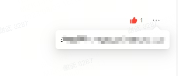

# Ant Design Pro项目Popover位置微调

### 前情

---

公司有经常需要做一些后台管理页面，我们选择了Ant Design Pro，它是基于 Ant Design 和 umi 的封装的一整套企业级中后台前端/设计解决方案。

### 产品效果图

---

最新接到的一个后台管理界面需求，需要使用到Popover，但是在使用时发现那箭头位置不符合预期：

理想：



实际：


### 解决方案

从官网文挡并没有找到相关的调整位置的配置项，一开始想通过加margin、transform都失败告终，最后发现可以通过配置align的offset可以实现位置微调。

---

关键代码：

```jsx
<Popover 
    align={{
      offset: [18, 10]
    }} 
    placement="bottomRight" 
    content={content} 
    overlayClassName="comments-more-wrap" 
    trigger="click" 
    open={openReportBtn} 
    onOpenChange={handleOpenChange}
  >
    ...
  </Popover>
```