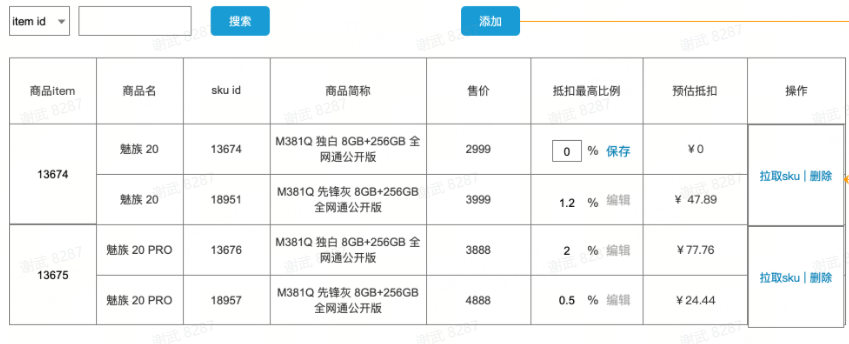

# Ant Design Pro项目ProTable怎么实现单元格合并效果

### 前情

---

公司有经常需要做一些后台管理页面，我们选择了Ant Design Pro，它是基于 Ant Design 和 umi 的封装的一整套企业级中后台前端/设计解决方案。

### 产品效果图

---

最新接到的一个后台管理界面需求，需要根据相同的itemId做单元格合并，要实现的效果如下：



### 解决方案

**方式1：使用表格的rowspan属性来实现单元格合并**

---

关键代码：

---

```jsx
/**
 * 实现单元格合并
 * 在原始数据中加上rowSpan属性，该值为接下来和当前项itemId相同的个数+1，
 * 其它相同的项rowSpan设为0即为不显示
 * @param list 
 */
const dataProcessingForRowspan = (list, key) => {
  let repeatCount = 1;
  let startIndex = 0;
  list.forEach((item, index) => {
    if (index < list.length - 1 && item.itemId === list[index+1].itemId) {
      item.rowSpan = 0;
      repeatCount += 1
    } else {
      list[startIndex].rowSpan = repeatCount;
      startIndex = index + 1;
      repeatCount = 1;
    }
  })
}

const columns: ProColumns<API.EduAuthenticatedUserItem>[] = [
    {
      title: '商品itemId',
      dataIndex: 'itemId',
      editable: false,
      render: (text: any, record: any, index: number) => {
        return {
          children: text || '',
          props: {
            rowSpan: record.rowSpan ? record.rowSpan : 0
          }
        }
      }
    },
		...
    {
      title: '操作',
      dataIndex: 'option',
      valueType: 'option',
      render: (text, record:any, index) => {
        return {
          children: [
            <a
              key="config"
              onClick={() => {
              }}
            >
              拉取sku
            </a>,
            ' | '
            ,
            <a
              key="delete"
              onClick={() => {
              }}
            >
              删除
            </a>,
          ],
          props: {
            rowSpan: record.rowSpan ? record.rowSpan : 0
          }
        }
      },
    },
  ];

return (
<PageContainer>
      <ProTable<API.EduAuthenticatedUserItem, API.AuthenticatedUserParams>
        headerTitle=''
        rowKey="skuId"
        search={{
          labelWidth: 120,
        }}
        toolBarRender={() => [
        ]}
        request={async (params) => {
          await waitTime(3000)
					// 这里是模拟的数据
          const initData = [{
            itemId: '1',
            name: '魅族20',
            skuId: 'a123456b',
            productAbbreviation: '魅族20 独白 8GB+256GB 全网通公开版',
            price: 2459,
            maximumDeduction: 3,
            estimatedDeduction: 49.18
          },{
            itemId: '1',
            name: '魅族20',
            skuId: 'b123456b',
            productAbbreviation: '魅族20 独白 8GB+256GB 全网通公开版',
            price: 2459,
            maximumDeduction: 2,
            estimatedDeduction: 49.18
          },{
            itemId: '2',
            name: '魅族20',
            skuId: 'c123456b',
            productAbbreviation: '魅族20 独白 8GB+256GB 全网通公开版',
            price: 2459,
            maximumDeduction: 1,
            estimatedDeduction: 49.18
          },{
            itemId: '2',
            name: '魅族20',
            skuId: 'd123456b',
            productAbbreviation: '魅族20 独白 8GB+256GB 全网通公开版',
            price: 2459,
            maximumDeduction: 1,
            estimatedDeduction: 49.18
          },{
            itemId: '2',
            name: '魅族20',
            skuId: 'e123456b',
            productAbbreviation: '魅族20 独白 8GB+256GB 全网通公开版',
            price: 2459,
            maximumDeduction: 1,
            estimatedDeduction: 49.18
          },{
            itemId: '3',
            name: '魅族20',
            skuId: 'f123456b',
            productAbbreviation: '魅族20 独白 8GB+256GB 全网通公开版',
            price: 2459,
            maximumDeduction: 1,
            estimatedDeduction: 49.18
          }]

          dataProcessingForRowspan(initData, 'itemId');
          return {
            data: initData,
            // success 请返回 true，
            // 不然 table 会停止解析数据，即使有数据
            success: true,
            // 不传会使用 data 的长度，如果是分页一定要传
            total: 5,
          };
        }}
        columns={columns}
      />
    </PageContainer>
);
```

**方式2：直接自定义reander方法，在一个单元格中生成遍历的内容，内容块之间加下边框，实现伪单元格合并效果**

关键代码:

```jsx
const columns: ProColumns<API.EduAuthenticatedUserItem>[] = [
    {
      title: '商品itemId',
      dataIndex: 'itemId',
      editable: false,
    },
    {
      title: '商品名',
      dataIndex: 'itemName',
    },
    {
      title: 'skuId',
      dataIndex: 'itemSkuList',
      key: 'skuId',
      render: (text: any, record: any) => {
        return record.itemSkuList.map((item: any, indexIn: number) => {
          return (
            <div
              key={item.skuId + '' + indexIn}
              style={{
                borderBottom: indexIn === record.itemSkuList.length - 1 ? '' : '1px solid #f0f0f0',
              }}
            >
              <div
                style={{
                  width: '100%',
                  height: '50px',
                  display: 'flex',
                  justifyContent: 'center',
                  alignItems: 'center',
                  margin: 'auto',
                }}
              >
                {item['skuId']}
              </div>
            </div>
          );
        });
      },
    },
    ...
    {
      title: '预估抵扣',
      dataIndex: 'itemSkuList',
      key: 'predictDeductionPrice',
      editable: false,
      hideInSearch: true,
      render: (text: any, record: any) => {
        return record.itemSkuList.map((item: any, indexIn: number) => {
          return (
            <div
              key={item.skuId + '' + indexIn}
              style={{
                borderBottom: indexIn === record.itemSkuList.length - 1 ? '' : '1px solid #f0f0f0',
              }}
            >
              <div
                style={{
                  width: '100%',
                  height: '50px',
                  display: 'flex',
                  justifyContent: 'center',
                  alignItems: 'center',
                  margin: 'auto',
                }}
              >
                {item['predictDeductionPrice']}
              </div>
            </div>
          );
        });
      },
    },
    {
      title: '操作',
      dataIndex: 'option',
      valueType: 'option',
      render: (text: any, record: any) => {
        return (
          <>
            <a
              key="config"
              onClick={async () => {
              }}
            >
              拉取sku
            </a>{' '}
            |{' '}
            <a
              key="delete"
              onClick={async () => {
              }}
            >
              删除
            </a>
          </>
        );
      },
    },
  ];

  return (
    <PageContainer>
      <ProTable<API.EduAuthenticatedUserItem, API.AuthenticatedUserParams>
        headerTitle=''
        rowKey="itemId"
        search={{
          labelWidth: 120,
        }}
        toolBarRender={() => [
        ]}
        request={async (params) => {
          await waitTime(3000)
          const initData = [{
            itemId: '1',
            itemSkuList:[
              {
                name: '魅族20',
                skuId: 'a123456b',
                productAbbreviation: '魅族20 独白 8GB+256GB 全网通公开版',
                price: 2459,
                maximumDeduction: 3,
                estimatedDeduction: 49.18
              },{
                name: '魅族20',
                skuId: 'b123456b',
                productAbbreviation: '魅族20 独白 8GB+256GB 全网通公开版',
                price: 2459,
                maximumDeduction: 2,
                estimatedDeduction: 49.18
              },{
                name: '魅族20',
                skuId: 'c123456b',
                productAbbreviation: '魅族20 独白 8GB+256GB 全网通公开版',
                price: 2459,
                maximumDeduction: 1,
                estimatedDeduction: 49.18
              },{

              }
            ]
          },{
            itemId: '2',
            itemSkuList: [
              {
                name: '魅族20',
                skuId: 'd123456b',
                productAbbreviation: '魅族20 独白 8GB+256GB 全网通公开版',
                price: 2459,
                maximumDeduction: 1,
                estimatedDeduction: 49.18
              },{
                name: '魅族20',
                skuId: 'e123456b',
                productAbbreviation: '魅族20 独白 8GB+256GB 全网通公开版',
                price: 2459,
                maximumDeduction: 1,
                estimatedDeduction: 49.18
              }
            ]
            
          },{
            itemId: '3',
            name: '魅族20',
            skuId: 'f123456b',
            productAbbreviation: '魅族20 独白 8GB+256GB 全网通公开版',
            price: 2459,
            maximumDeduction: 1,
            estimatedDeduction: 49.18
          }]

          dataProcessingForRowspan(initData, 'itemId');
          return {
            data: initData,
            // success 请返回 true，
            // 不然 table 会停止解析数据，即使有数据
            success: true,
            // 不传会使用 data 的长度，如果是分页一定要传
            total: 5,
          };
        }}
        columns={columns}
      />
    </PageContainer>
  );
```

- 注：二种方式是对不同的数据结构做的更优的方法，如果只想用其中一种，二种数据结构互转一下也可以的。