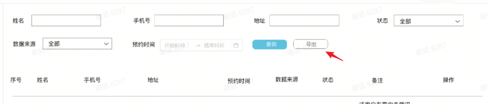

# Ant Design Pro项目ProTable怎么获取搜索表单值

### 前情

---

公司有经常需要做一些后台管理页面，我们选择了Ant Design Pro，它是基于 Ant Design 和 umi 的封装的一整套企业级中后台前端/设计解决方案。

### 产品效果图

---

最新接到的一个后台管理界面需求，如下图。需要实现数据导出功能，ProTable搜索栏默认有重置和查询按钮，所以需要增加一个导出按钮，那导出的条件是依赖搜索条件的，不像查询按钮本身就会触发request方法，里面可以拿到搜索表单的值。



### 解决方案

**方式1：使用useRef，通过ProTable的fromRef获取表单对象，再通过表单对象下的g**etFieldsValue**获取所有表单值，也可以以通过**getFieldValue(key)**获取单个表单值**

---

关键代码：

---

```jsx
const proTableFormRef = useRef<ProFormInstance>();
const exportBookingData = () => {
    const formFieldsValue = proTableFormRef.getFieldsValue();
		// 这里可以查到当前搜索表单的值
    console.log('---- exportBookingData ----:', formFieldsValue );
		// 接接参数，发起请求
		...
  };

...

<ProTable
  size="middle"
  rowKey="id"
  columns={columns}
  formRef={proTableFormRef}
  actionRef={actionFormRef}
  options={{ reload: false, density: false, fullScreen: true }}
  search={{
    labelWidth: 'auto',
    optionRender: ({ searchText, resetText }, { form }) => {
      return [
        <Button
          key="reset"
          style={{ marginRight: '10px' }}
          onClick={() => {
            actionFormRef?.current?.reset();
          }}
        >
          {resetText}
        </Button>,
        <Button key="search" type="primary" htmlType="submit" style={{ marginRight: '10px' }}>
          {searchText}
        </Button>,
        <Button
          key="export"
          loading={isExportIng}
          type="primary"
          onClick={exportBookingData}
        >
          导出
        </Button>,
      ];
    },
  }}
  pagination={{
    size: 'default',
    defaultPageSize: 10,
    showTotal: (total) => `共 ${total} 条`,
  }}
  request={requestBookingDataList}
/>
```

**方式2：在通过search下的optionRender方法自定导出按钮的时候，它的第二个参数可以查到当前搜索表单对象，可以把此表单对象直接传给导出事件绑定的方法，再通过表单对象下的g**etFieldsValue**获取所有表单值，也可以以通过**getFieldValue(key)**获取单个表单值**

关键代码:

```jsx
const exportBookingData = (form) => {
    const formFieldsValue = form.getFieldsValue();
		// 这里可以查到当前搜索表单的值
    console.log('---- exportBookingData ----:', formFieldsValue );
		// 接接参数，发起请求
		...
  };

...

<ProTable
  size="middle"
  rowKey="id"
  columns={columns}
  formRef={proTableFormRef}
  actionRef={actionFormRef}
  options={{ reload: false, density: false, fullScreen: true }}
  search={{
    labelWidth: 'auto',
    optionRender: ({ searchText, resetText }, { form }) => {
      return [
        <Button
          key="reset"
          style={{ marginRight: '10px' }}
          onClick={() => {
            actionFormRef?.current?.reset();
          }}
        >
          {resetText}
        </Button>,
        <Button key="search" type="primary" htmlType="submit" style={{ marginRight: '10px' }}>
          {searchText}
        </Button>,
        <Button
          key="export"
          loading={isExportIng}
          type="primary"
          onClick={() => exportBookingData(form)}
        >
          导出
        </Button>,
      ];
    },
  }
  pagination={{
    size: 'default',
    defaultPageSize: 10,
    showTotal: (total) => `共 ${total} 条`,
  }}
  request={requestBookingDataList}
/>
```

- 注：二种方式都可以完成此需求，从使用方便考虑，推荐第二种

### 思考

定义一个标志变量，标示当前是查询还是导出，在导出的时候主动触发查询方法，在查询方法里

拿到表单值，再把当前的表单值用于导出请求，方法千千W，你是否有更好的方式推荐了？期待你的分享。