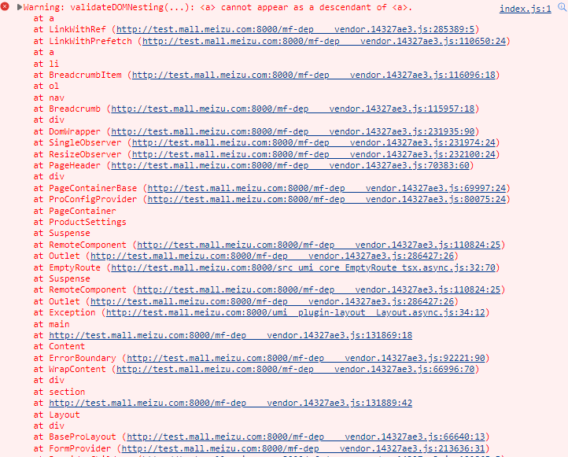
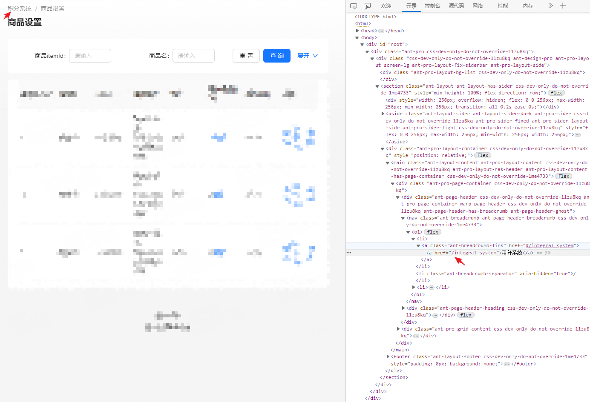

# Ant Design Pro项目一初始化就报a标签嵌套a标签错误<a> cannot as a descendant of <a>

### 前情

---

公司有经常需要做一些后台管理页面，我们选择了Ant Design Pro，它是基于 Ant Design 和 umi 的封装的一整套企业级中后台前端/设计解决方案。

### 坑位

---

按官方文挡一步步下来，项目启动后发现控制台就有一个报错，报错截图如下：



### Why?

---

从报错的提示看是项目出现了a标签嵌套a标签的情况，最终对页面上有跳转功能的地方做了一遍筛查，发现是在面包屑那里出现了a标签嵌套a标签，详情见下图：



### 解决方案

---

重写面包屑渲染方法即可，通过在项目下src/app.tsx文件中重写itemRender方法即可

**关键代码：**

---

```jsx
	...
	itemRender: (route: any, params, routes) => {
    return <span>{route.breadcrumbName}</span>
  },
	...
```