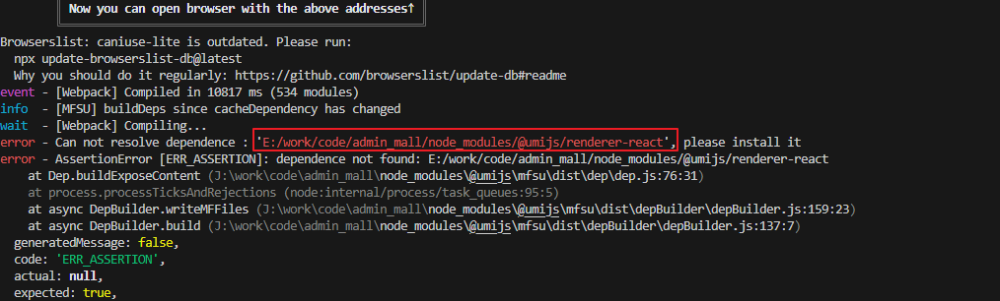

# Ant Design Pro项目启动报can not resolve dependence：’…/node_modules/@umijs/renderer-react‘

### 前情

---

公司有经常需要做一些后台管理页面，我们选择了Ant Design Pro，它是基于 Ant Design 和 umi 封装的一整套企业级中后台前端/设计解决方案。

### 坑位

---

今天启动项目报如下图

### Why?

---

网上资料了解说是项目路径更新会有这个错，而我电脑因为多装了一个硬盘，导致盘符变化了，也就间接的导致项目路径发生了变化吧。

### 解决方案

---

找到项目根目录下node_modules下的.cache目录，再重新 npm start运行项目即可。

