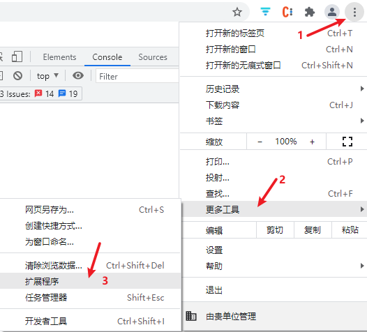
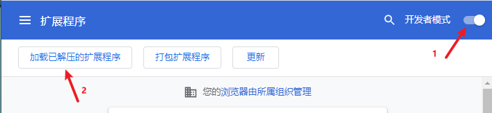

# Chrome浏览器本地安装插件

### **前情**

Chrome是目前世面上很受欢迎的浏览器，你可以通过它的插件扩展功能安装插件优化使用体验和增加功能。

### 坑位

对于国内受墙影响的用户无法直接通过应用商店安装插件，通过离线安装插件会发现浏览器会提示：“无法从该网站添加应用，扩展程序和用户脚本”

### why?

自Chrome 67版本开始，谷歌调整Chrome的插件安装策略，只允许用户在应用商店中安装插件！也就是说，原有的离线安装插件方式，已经被禁止。拖放crx文件时会报错。

### 解决方案

1. 启动chrome浏览器点击左上解竖三点图标→更多工具→扩展程序，或者在址址栏直接输入：chrome://extensions/

2. 开启开发者模式，再选择加载已经解压的扩展程序（网上下载的crx插件可以把它的后辍改成zip格式，再解压）找到解压后的目录即可安装当前插件

### 几个国内Chrome插件寻处

对于国内用户，大多受墙困扰，下面是几个国内的几个Chrome插件集合站，希望能找到你所需要一些插件，实在找不着那就百度搜索下载吧。

[https://www.crx4chrome.com/](https://www.crx4chrome.com/)

[https://www.chromefor.com](https://www.chromefor.com/)

[https://extfans.com/](https://extfans.com/)