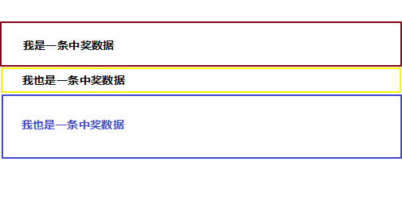

# DOM元素高度获取踩坑

### 前情

最近在开发一个需求，需要做一个滚动列表展示当前中奖用户，但是列表每一项高度又不是固定的，每次滚动前需要先获取当前要滚动的块是多高才知道要滚动多少。



### 坑位

在开发这个滚动列表的时候发现滚着滚着就会出现滚动距离出现差距，慢慢的滚动距离不够一块高度，而且误差会越来越大，到最后复位的时候能明显看出跳跃感。

### Why?

因为我这是个移动端项目，使用的REM适配方式做的布局，DOM尺寸会出现小数的情况，而我用来获取元素高度的API是offsetHeight，offsetHeight在获取高度的时候会舍弃小数位。

### 解决办法

#### 方式1

使用 **getComputedStyle()** 方法来获取准确的元素高度

```javascript
const luckyItem = document.querySlector('.lucky-item');
let height = window.getComputedStyle(luckyItem ,null).height  //得到 18.7656px
let num = parseFloat(height.substring(0,height.indexOf('px'))); // 得到18.7656

```

此方法虽然可行，但是有一定缺陷,需要考虑到有padding和border的情况

```javascript
const luckyItem = document.querySlector('.lucky-item');
const {height,paddingTop,paddingBottom,border} = window.getComputedStyle(luckyItem ,null);
let height = parseFloat(height) + parseFloat(paddingTop) + parseFloat(paddingBottom) + parseFloat(border); //得到 18.7656

```

#### 方式2(推荐)

使用getBoundingClientRect方法来获取准确的元素高度

```javascript
const luckyItem = document.querySlector('.lucky-item');
let height = luckyItem.getBoundingClientRect().height  //得到 18.7656
```

> 注：对于小数点位数要不要做精度到2位或者多少位处理，我们可以不用管，交由浏览器去处理吧。
