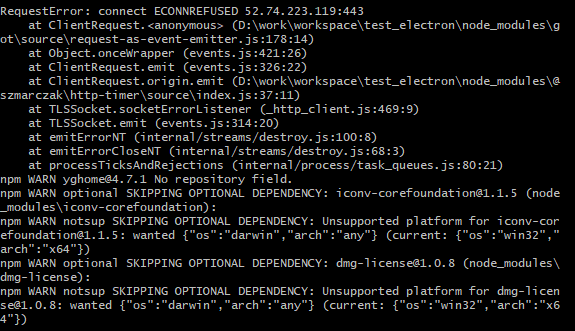

# Electron包下载经常失败、太慢问题

### 前情

---

公司有个桌面端项目是基于Electron开发的。

### 坑

---

在项目初始化的时候，需要通过npm install安装项目需要依赖的模块，但是经常报Electron安装失败，使用cnpm或者把源切换到淘宝源也不行。




### Why?

---

看提示应该是跟网络有关，有可能是公司网络做了限制了，还有可能是资源在国外，想顺利安装需要科学上网，但是不知道为什么我使用cnpm或者使用淘宝源安装也不行，有可能是淘宝源有部分包并不全吧。

### 解决方案

---

方案1：科学上网搞起，可以解决很多包失败问题

方案2：通过在项目根目录下增加一个.npmrc文件，内容如下：

```bash
electron_mirror=https://npm.taobao.org/mirrors/electron/
```

参考链接：[https://blog.csdn.net/qwe25878/article/details/110952807](https://blog.csdn.net/qwe25878/article/details/110952807)

