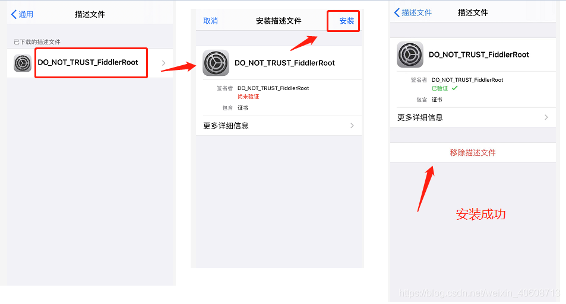
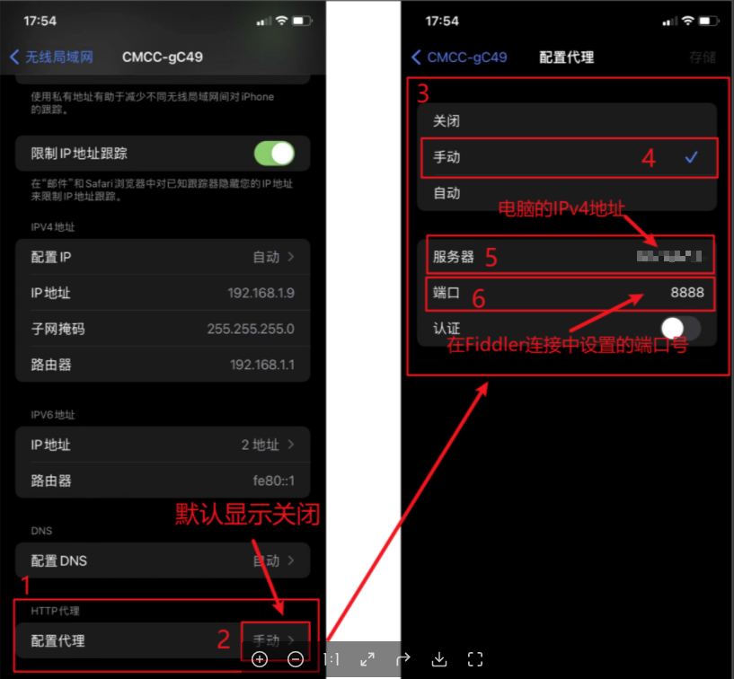

# Fiddler抓包iOS手机

### 前情

平时做移动移动端开必的时候经常需要抓包手机，用于接口请求跟踪，但iOS的抓包经常性的配不成功，经过踩过不少坑后终于知道了整个配置流程，此文记录Fiddler抓包iOS手机的配置流程。

### Step 1：Fiddler配置

通过工具栏Tools-Options打开配置弹框，如下图

再options弹框中打开Connections选项，做如下设置

打开HTTPS选项，做如下设置

同时点击右侧actions，下载证书到桌面，再安装证书

### Step 2：iOS手机端配置

查看电脑ip，win+r输入cmd，打开window的命令行窗口，输入ipconfig，其中IPv4就是你的ip地址

手机端连接和电脑属于同一局域网的wifi

用Safari浏览器打开网址：你的IP地址:8888 ,点击【FiddlerRoot certificate】下载证书，再回到手机的【设置】-【通用】中，找到“描述文件”，安装证书

注意！安装成功后，必须要回到【设置】-【通用】-【关于本机】中，对证书进行信任设置，否则会出现无法抓到包的情况

进入【设置】，查看连接的WIFI，进入HTTP代理，设置为手动，然后填写服务器：输入fiddler的电脑ip地址和端口：8888，点击【存储】保存即可。

至此，应该就能成功抓到手机的包了，如果还不行，查看一下是不是电脑的防火墙，是否没有允许 Fiddler程序 通过防火墙。

说明：其中部分图片并不是我自己的截图都是来自网络，只是用于表示操作示范。
