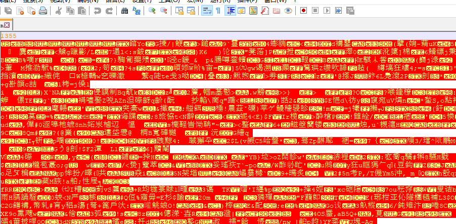
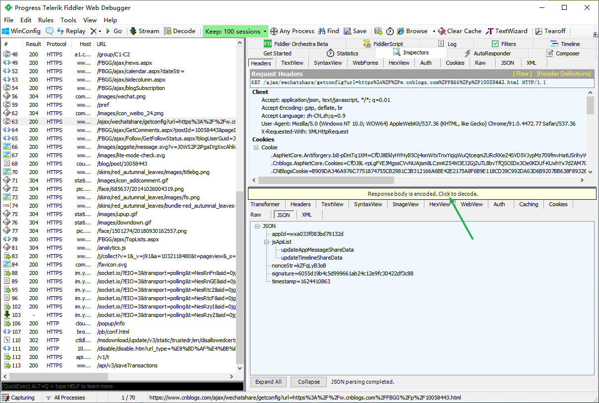
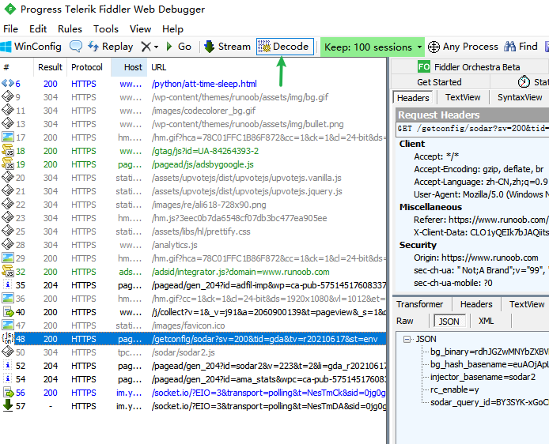
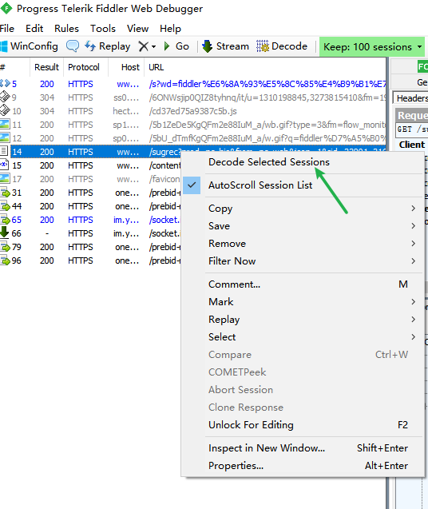

# Fiddler抓包数据乱码

### 前情

---

最近在项目测试中，使用到Fiddler来抓包看接口请求相关的情况

### 坑

---

通过Fiddler抓包，在Fiddler中看到的数据都是正常的，但是保存到本地，发现数据是乱码

### Why?

---

工具里的提示是这样的：Response body is encouded.Click to decode.请求到的数据服务端执行了编码操作，需要解码才能正确显示。

### 解决方案

---

1. 抓包到数据后点击如下地方执行解码，再保存接口数据即可

    

2. 也可点击如下图位置打开自动解码功能，后续抓包会自动执行解码

    

3. 也可在想要解码的接口请求上右击，再点击Decode Selected Sessions针对当前选择的请求执行解码

    

4. 网上还流传一种解决方法就是通过修改注册表来解决（我尝试是失败的）
    1. 打开运行输入框：win+R
    2. 打开注册表编辑器：输入regedit +回车+是
    3. 找到如下层级位置：HKEY_CURRENT_USER\Software\Microsoft\Fiddler2
    4. 右键新建，选字符串值，加上HeaderEncoding，然后值输入 GBK（建议设置为UTF-8），再重启fiddler