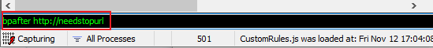

# Fiddler模拟网络超时

### **前情**

最近在优化接口请求错误的报错提示，希望尽可能的能从提示语知道当前错误大致原因，于是我需要模拟各种错误请求的状况。

### 问题

网络超时是很常见的接口请求错误情况，在没有服务端配合的情况下，我需要怎样来模拟出网络超时情况了

### 解决方案

通过Fiddler可以模拟出网络超时的情况，此处有二种实现方式

### 方案1

1. Rules -> Customize Rules，搜索内容 "oSession["response-trickle-delay"]" ，修改一下这里就行了. 把它的值设为15000，保存文件。这里的值本来是150，具体设为多大，看你接口请口设置的timeout时间是多久，比它大一些即可。
2. Rules -> Performance -> Simulate Modem Speeds 勾选再发起请求，这样就能够模拟超时了。

### 方案2

在fiddler命令行输入 bpafter http://needstopurl 直接阻塞对应url的返回即可模拟接口请求超时，如后续想取消，直接在命令行输入bpafter即可取消接口阻塞

