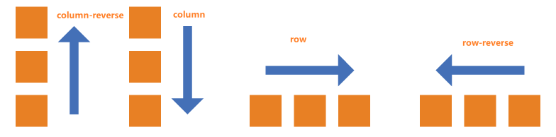
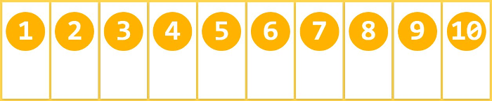
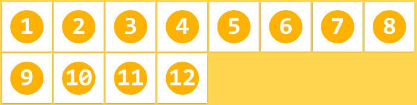
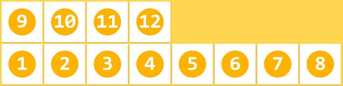
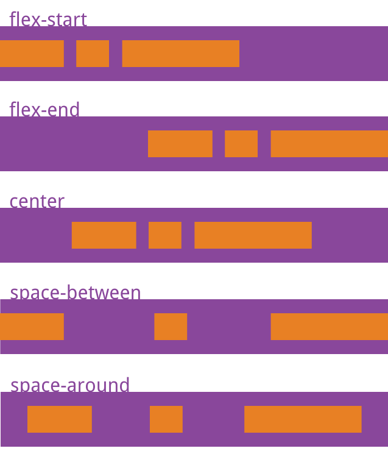
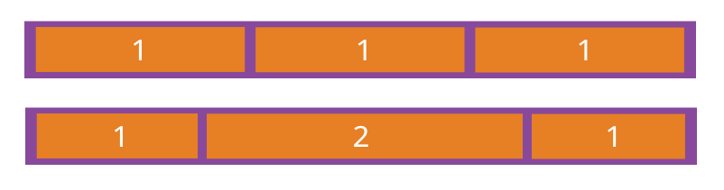
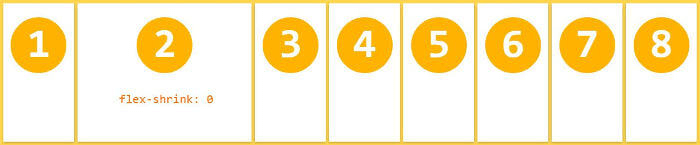
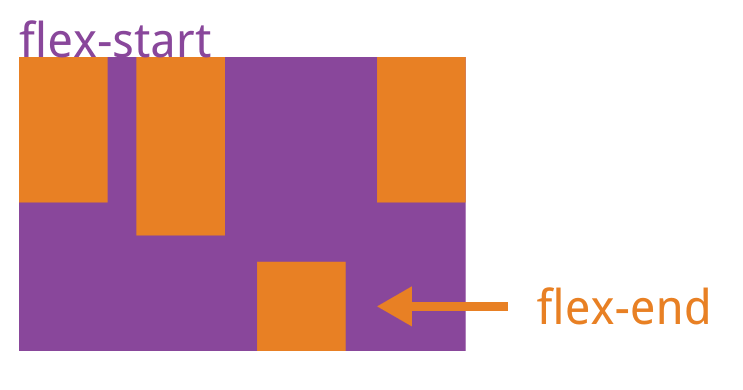
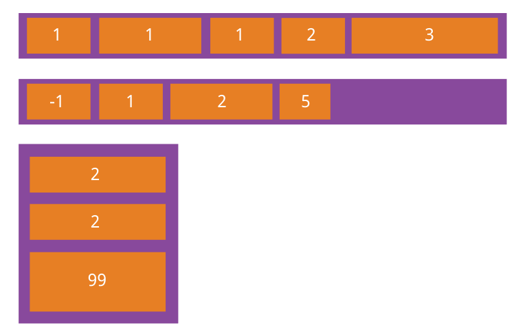

# Flex 弹性布局备忘录

## 概述

Flex 是 Flexible Box 的缩写，意为"弹性布局"，用来为盒状模型提供最大的灵活性

这也是我目前用的最多的一种布局方案，相比Grid布局此种布局方案相对较简单，容易掌握性。而且兼容性也好过Grid

## 基本概念

### **容器和项目**

采用 Flex 布局的元素，称为 Flex 容器（flex container），简称"容器"。它的所有子元素自动成为容器成员，称为 Flex 项目（flex item），简称"项目"

```html
<div class="container">
  <div class="item"><p>1</p></div>
  <div class="item"><p>2</p></div>
  <div class="item"><p>3</p></div>
</div>
```

### 主轴（main axis）

默认水平的为主轴，此属性主要跟flex-direction有关，如果为`row`则水平是主轴，如果为`column`则主轴为垂直方向

### 交叉轴（cross axis）

默认垂直的为交叉轴，此属性主要跟flex-direction有关，如果为`row`则垂直方向是交叉轴，如果为`column`则交叉轴为水平方向

## 容器属性

### **display**

`display:` flex指定一个容器采用弹性布局

```css
.container{
	display: flex;
	// display: inline-flex; 采用弹性布局，但容器表现为行内元素特性
}
```

> 注：任何一个容器都可以指定为 Flex 布局，指定为flex布局以后，子元素的`float`、`clear`和`vertical-align`属性将失效
> 

演示示例：[https://jsbin.com/hepovanuba/4/edit?html,css,output](https://jsbin.com/hepovanuba/4/edit?html,css,output)

### **flex-direction**

属性决定主轴的方向（即项目的排列方向）

```css
/*
* row（默认值）: 主轴为水平方向，起点在左端
* row-reverse: 主轴为水平方向，起点在右端
* column: 主轴为垂直方向，起点在上沿
* column-reverse: 主轴为垂直方向，起点在下沿
*/
.container {
  flex-direction: row | row-reverse | column | column-reverse;
}
```



### **flex-wrap**

默认情况下，项目都排在一条线（又称"轴线"）上。`flex-wrap`属性定义，如果一条轴线排不下，是否能换行及如何换行

```css
/*
* nowrap（默认值）：不换行
* wrap：换行
* wrap-reverse ：第一行在下方
*/
.container 
	flex-wrap: nowrap | wrap | wrap-reverse; 
}
```

1. nowrap(默认)，不换行
   
    
    
2. wrap：换行，第一行在上方
   
    
    
3. wrap-reverse：换行，第一行在下方
   
    
    

演示示例：[https://jsbin.com/ducajigafu/3/edit?html,css,output](https://jsbin.com/rupisuquge/2/edit?html,css,output)

### **flex-flow**

是`flex-direction`属性和`flex-wrap`属性的简写形式，默认值为`row nowrap`

```jsx
.container
  flex-flow: <flex-direction> | <flex-wrap>;
}
```

### **justify-content**

定义了项目在主轴上的对齐方式

```jsx
/*
* flex-start（默认值）：左对齐
* flex-end：右对齐
* center： 居中显示
* space-between：两端对齐，项目之间的间隔都相等
* space-around：每个项目两侧的间隔相等。所以，项目之间的间隔比项目与边框的间隔大一倍
*/
.container {
  justify-content: flex-start | flex-end | center | space-between | space-around;
}
```



演示示例：[https://jsbin.com/kibekiduzu/2/edit?html,css,output](https://jsbin.com/kibekiduzu/2/edit?html,css,output)

### **align-items**

定义项目在交叉轴上如何对齐

```css
/*
* flex-start（默认值）：交叉轴的起点对齐
* flex-end：交叉轴的终点对齐
* center：交叉轴的中点对齐
* baseline：项目的第一行文字的基线对齐
* stretch：如果项目未设置高度或设为auto，将占满整个容器的高度
*/
.container {
  align-items: flex-start | flex-end | center | baseline | stretch;
}
```


演示示例：[https://jsbin.com/cotaxagelu/edit?html,css,output](https://jsbin.com/cotaxagelu/edit?html,css,output)

> stretch只对项目未设置高度或设为auto的值才有效; 当align-items : baseline的时候，子元素的vertical-align是有效的
> 

### **align-content**

定义了多根轴线的对齐方式。如果项目只有一根轴线，该属性不起作用

```css
/*
* flex-start：与交叉轴的起点对齐
* flex-end：与交叉轴的终点对齐
* center：与交叉轴的中点对齐
* space-between：与交叉轴两端对齐，轴线之间的间隔平均分布
* space-around：每根轴线两侧的间隔都相等。所以，轴线之间的间隔比轴线与边框的间隔大一倍
* stretch（默认值）：轴线占满整个交叉轴
*/
.container {
  align-content: flex-start | flex-end | center | space-between | space-around | stretch;
}
```


演示示例：[https://jsbin.com/muzujugida/edit?html,css,output](https://jsbin.com/muzujugida/edit?html,css,output)

## 项目属性

### flex-grow

定义项目的放大比例，默认为`0`，即如果存在剩余空间，也不放大，所有项目的`flex-grow`属性都为1，则它们将等分剩余空间，假设有一个项目为2，其它都是1.则当前为2的项目的占据的剩余空间将比其他项多一倍

```css
.item {
  flex-grow: <number>; /* default 0 */
}
```



演示示例：[https://jsbin.com/macolexuwe/edit?html,css,output](https://jsbin.com/macolexuwe/edit?html,css,output)

### **flex-shrink**

定义了项目的缩小比例，默认为1，即如果空间不足，该项目将缩小

如果所有项目的`flex-shrink`属性都为1，当空间不足时，都将等比例缩小，如果一个项目的`flex-shrink`属性为0，其他项目都为1，则空间不足时，前者不缩小，负值对该属性无效

```css
.item {
  flex-shrink: <number>; /* default 1 */
}
```



演示示例：[https://jsbin.com/niwizavepe/1/edit?html,css,output](https://jsbin.com/niwizavepe/1/edit?html,css,output)

### **flex-basis**

定义了在分配多余空间之前，项目占据的主轴空间（main size）。浏览器根据这个属性，计算主轴是否有多余空间。它的默认值为`auto`，即项目的本来大小

它可以设为跟`width`或`height`属性一样的值（比如350px），则项目将占据固定空间

```css
.item {
  flex-basis: <length> | auto; /* default auto */
}
```

### **flex**

是`flex-grow`, `flex-shrink` 和 `flex-basis`的简写，默认值为`0 1 auto`。后两个属性可选

该属性有两个快捷值：`auto` (`1 1 auto`) 和 none (`0 0 auto`)

```css
.item {
  flex: none | [ <'flex-grow'> <'flex-shrink'>? || <'flex-basis'> ]
}
```

演示示例：[https://jsbin.com/levisotafo/edit?html,css,output](https://jsbin.com/levisotafo/edit?html,css,output)

### **align-self**

`align-self`属性允许单个项目有与其他项目不一样的对齐方式，可覆盖

`align-items`属性。默认值为`auto`，表示继承父元素的`align-items`属性

```css
.item {
  align-self: auto | flex-start | flex-end | center | baseline | stretch;
}
```



演示示例：[https://jsbin.com/vigiremavu/2/edit?html,css,output](https://jsbin.com/vigiremavu/2/edit?html,css,output)

### order

定义项目的排列顺序。数值越小，排列越靠前，默认为0

```css
.item {
  order: <integer>;/* default 0 */
}
```



演示示例：[https://jsbin.com/yetagoraje/edit?html,css,output

此录备录绝大部分内容都来自阮一峰的Flex布局教程博文，补充了一些示例，方便在线修改代码测试，阮一峰的这篇博文是目前我发现最全最易懂介绍Flex布局，原博文链接如下：[https://www.ruanyifeng.com/blog/2019/03/grid-layout-tutorial.html](https://www.ruanyifeng.com/blog/2015/07/flex-grammar.html)

