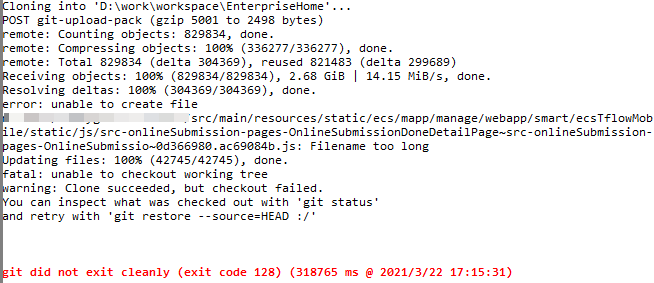

# Git for windows下Filename too long

### 前情

---

Git（读音为/gɪt/）是一个开源的分布式版本控制系统，可以有效、高速地处理从很小到非常大的项目版本管理，我公司目前都是基于Git来管理项目代码的。

### 坑位

---

最近在拉取代码时报如下错误，其中有句最显眼的是“Filename too long”，大概意思是说文件名太长，详细错误如下图示：



### **Why?**

---

Git有可以创建4096长度的文件名，然而在windows最多是260，因为Git用了旧版本的windows api。

### 解决方案

---

我们只要修改Git的配置即可，打开命令行，执行如下命令即可：

```bash
git config --global core.longpaths true
```