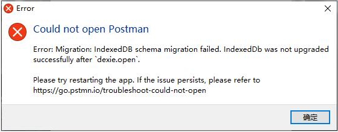

# Postman无法启动

### 前情

---

最近在捣鼓node.js，需要一个接口测试工具，而Postman是业界有名的接口测试工具，自然接口测试就用它了。

### 坑

---

已经有一段时间没启动Postman了，突然发现启动一直卡在修复界面，重启也不行，反复尝试发现如下错误。

### Why?

---

个人猜测，应该长时间未启动，很多环境配置都有改变，导致Postman无法启动

### 解决方案

---

1. 打开任务管理器（Ctrl+Alt+Delete）找到postman相关的所有进程关闭掉
2. 打开文件管理器（Win E）路径：C:\Users\你的电脑名字\AppData\Roaming\Postman，删除里边所有文件
3. 重启postman

参考链接：[https://www.yj521.com/article/156.html](https://www.yj521.com/article/156.html)