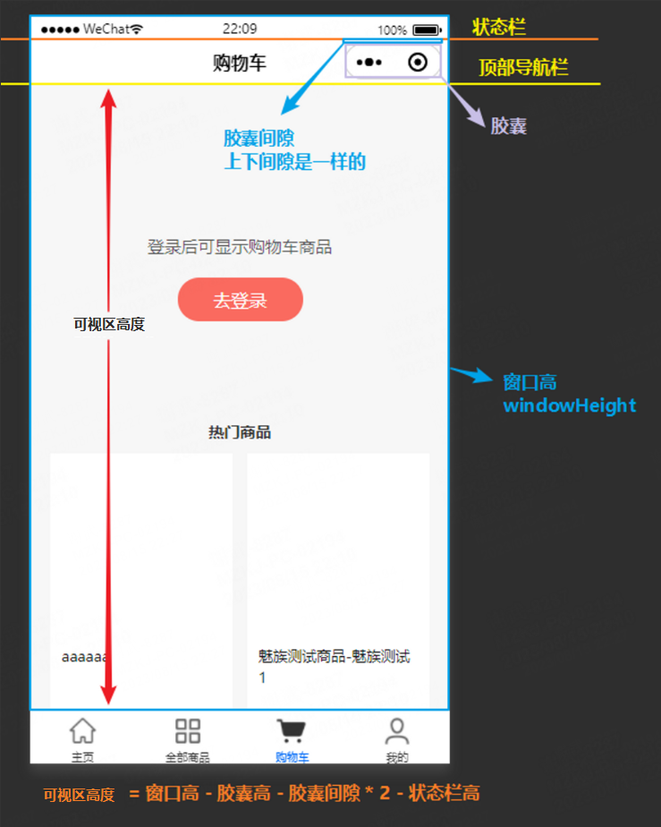

# Taro获取Tab页可视区域高度

### **前情**

公司有自己的小程序项目，因公司主要技术栈为react，所以选择了Taro来开发，Taro是京东出品的多端统一开发解决方案，用来开发小程序也相比用原生开发，在开发体验上好很多，而且还能使用成熟的React技术栈。

### Tab页可视区域高度获取原理图解

注：当前tab页未开启沉浸式导航栏模式



### 可操作区域高度获取方法

- 通过getSystemInfoSync接口获取窗口高和状态栏高度，参见文挡：[Taro.getSystemInfoSync() | Taro 文档 (jd.com)](https://taro-docs.jd.com/docs/apis/base/system/getSystemInfoSync)
- 通过getMenuButtonBoundingClientRect获取胶囊的位置信息，参见文挡：[Taro.getMenuButtonBoundingClientRect() | Taro 文档 (jd.com)](https://taro-docs.jd.com/docs/apis/ui/menu/getMenuButtonBoundingClientRect)

关键代码如下:

```jsx
// 获取窗口和状态栏高度
const {windowHeight, statusBarHeight} = Taro.getSystemInfoSync(); 
// 获取菜单按钮（右上角胶囊按钮）的布局位置信息。坐标信息以屏幕左上角为原点
const menuButtonBoundingInfo = Taro.getMenuButtonBoundingClientRect();
// 可操作区域的高等于窗口高 - 顶部导航的高 - 状态栏的高
// 顶部导航的高 = 胶囊的高 + 胶囊上间隙 + 胶囊下间隙
const clientHeihgt = windowHeight - statusBarHeight - (menuButtonBoundingInfo.top - menuButtonBoundingInfo.bottom) - (menuButtonBoundingInfo.top - systemInfo.statusBarHeight) * 2;
```