# Uniapp And Taro一些小测评

### 前情

最近公司准备新开发一个小程序项目，对于使用哪一款小程序框架有一些犹豫，我有过2年左右的uniapp项目开发经验，Taro在刚刚出来的时候有尝试过，经常莫名报错需要重启，在内心是有些偏向uniapp一方的，趁项目还未正式启动前，老大也愿意给时间去尝试的情况下，为什么不做个小测评对比对比了。

***

### 初始化项目

Uniapp：通过自带Hbuilderx可视化初始化项目

Taro：通过命令行初始化项目

taro初始化项目在npm install这一块基本是卡死的，我试过了几次都没有一次是成功的，都是手动cd到项目目录下，再手动执行npm install才能成功初始化，我猜有可能是跟个人网络有关。

***

### 项目启动

Uniapp：自带的Hbuilderx+微信开发者工具

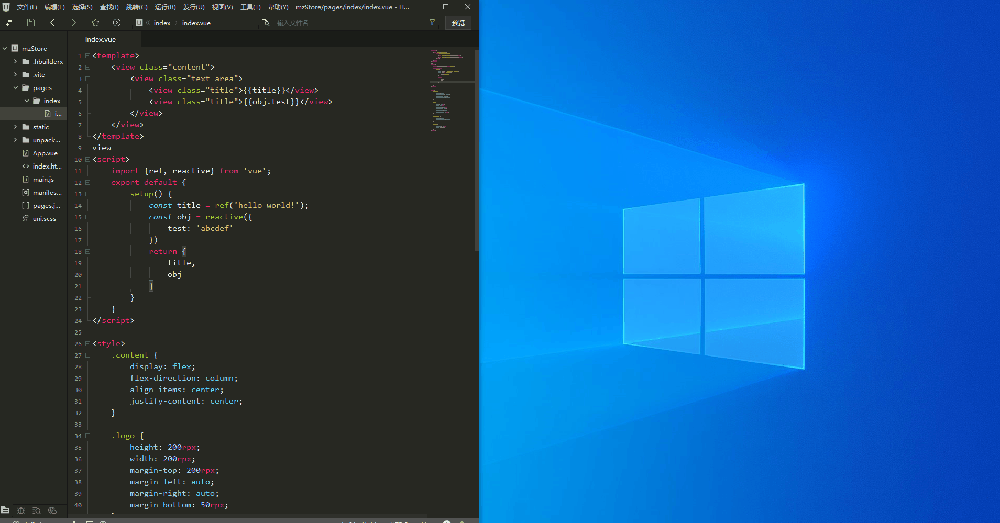

Taro：vs code + 微信开发者工具

Uniapp可以做到一键启动，而Taro则需要先启动项目代码，再手动启动小程序IDE指定到项目根目录。

***

### 开发体验

Uniapp：因为有自带的IDE加持，代码提示十分强悍。

Taro： 基于vs code，代码提示偏弱，而且对于小程序的普通的View Text等标准组件都需一个一个单独引入使用，好像如果用Vue也是不需要的。

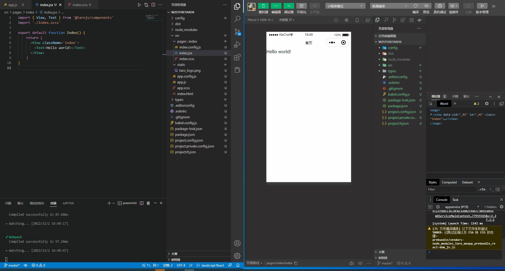

**再来看一下新增路由和设置tabBar，这是每个项目的基础需求**

Uniapp全流程可以通过鼠标点击即可完成，很丝滑，基本可以靠提示脱离文挡完成一些配置

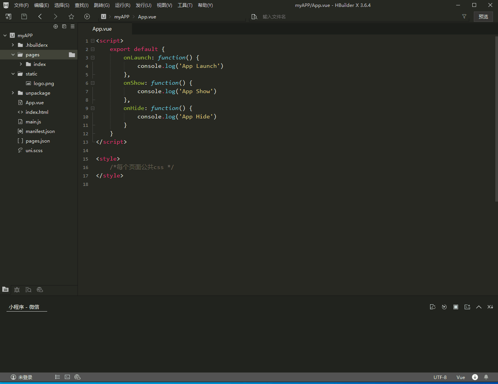

Taro就是真正的码砖了，我写过一段时间小程序，在没有提示的情况下，我还是很有需要去翻翻文挡的，当然有插件可以支持，但在官方文挡里没有特别说明

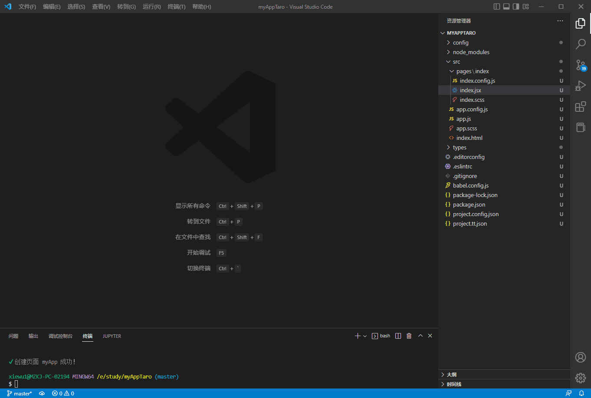

**还有一个在开发中不能少的，可以极大提高开发效率的：热更新**

Uniapp：热更很细滑，速度也快，特别现在有vue3 + vite的支持，真的有点快

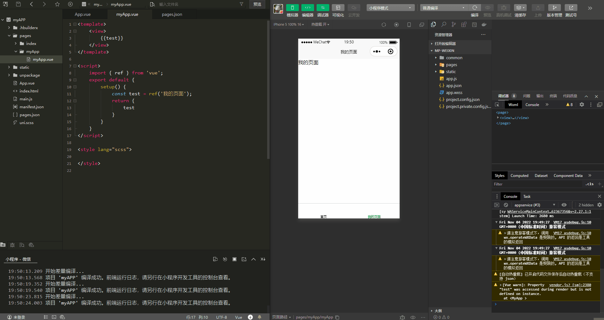

Taro：按官方文挡的说明，小程序IDE指向根目录，开发过程中热更时有时无，而且修改文字是百分百不会更新，如果开发中报错了，那你得手动编译小程序

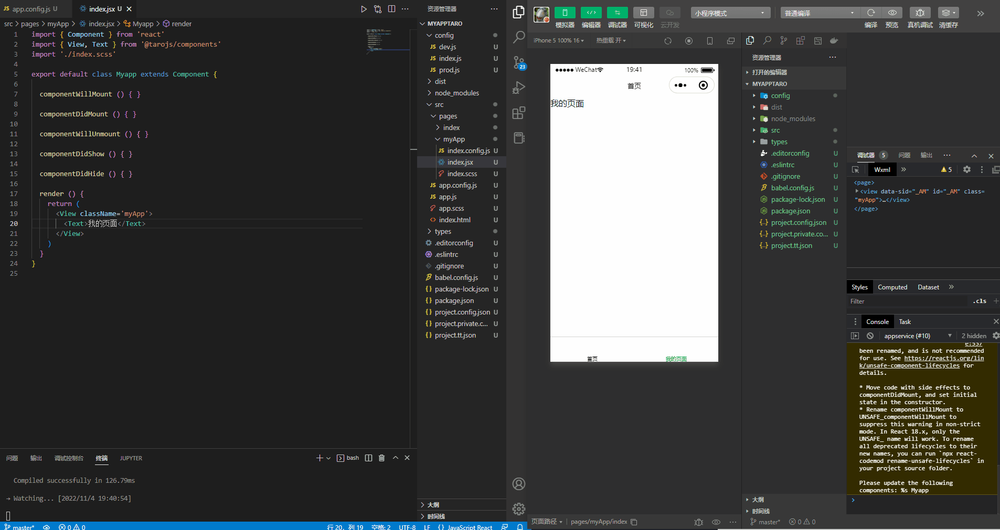

Taro热更不稳问题在我做demo的时候搞得我很头疼，据同事推荐说把小程序指向dist，热更就会稳，但事实是那根本就不是热更了，那是直接刷新了，但是总比手动重新编译的好，我的demo就是在此情况下开发完的。

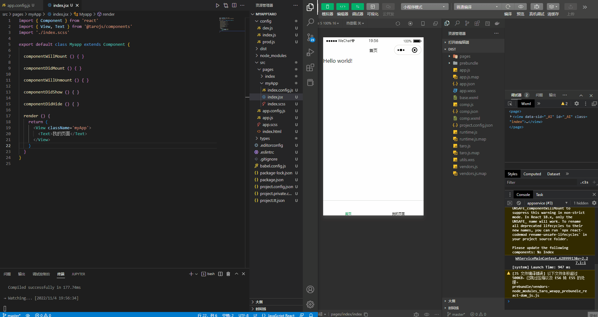

***

### **代码包体积**

测试条件：helloworld项目，二个tab，未添加任何第三方库和图片等资源， 未进行压缩

Uniapp

开发版：总包175KB，文件数14

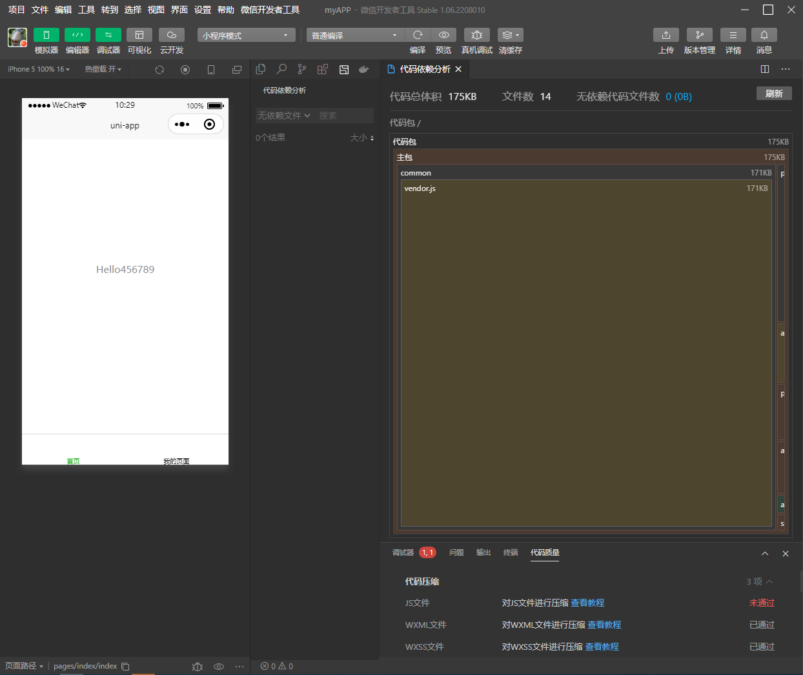

构建发包版：总包61kb 文件数14

Taro

开发版：总包1.32M，文件数32

构建发包版：总包249kb 文件数20

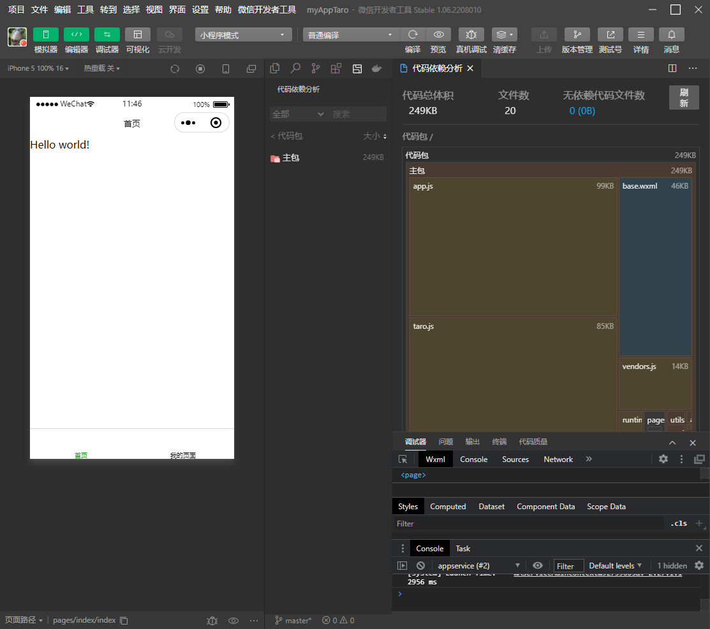

***

### 条件编译

要实现跨端说不写兼容代码是不太可能的，所以条件编译是必须得有的，双方都支持条件编译，通过书写不同的代码去解决不同端的兼容问题

Uniapp： 借鉴C 语言中的 #ifdef、#ifndef 的方式，uniapp提供了条件编译手段，在一个工程中可以优雅的完成平台个性需求和兼容处理，再加上强大的IDE代码提示，写条件编译很高效，条件编译代码就是普通的代码注释，哪里需要包哪里，有时可以细做到一个注释实现单个key值的条件编译，我基于此的启发，还写了个ifplus的条件编译loader：[https://www.npmjs.com/package/ifplus-loader](https://www.npmjs.com/package/ifplus-loader "https://www.npmjs.com/package/ifplus-loader")。

js的条件编译：

css的条件编译：

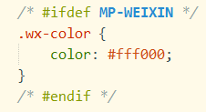

html的条件编译：

json配置文件的条件编译：

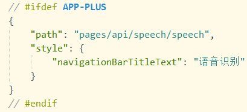
再来看一下条件编译舒适的书写方式

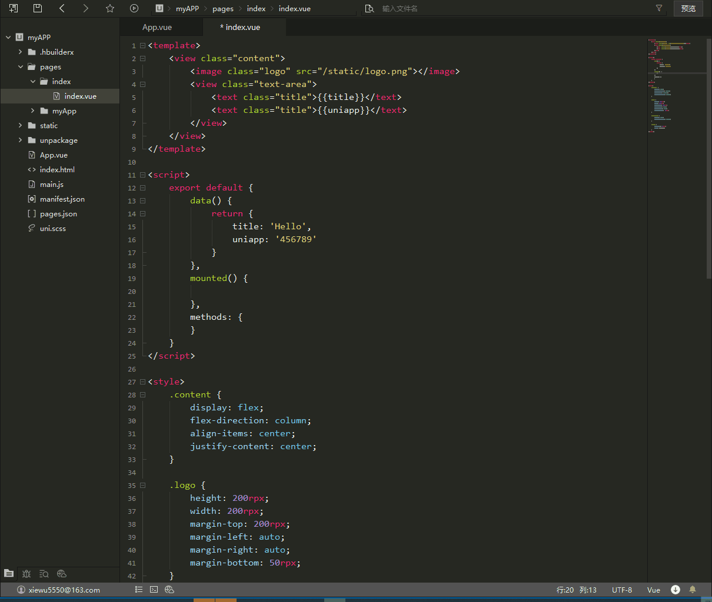

还有文件和目录的条件编译，可以说是基本全考虑到了，官方介绍文挡：[https://uniapp.dcloud.net.cn/tutorial/platform.html](https://uniapp.dcloud.net.cn/tutorial/platform.html "https://uniapp.dcloud.net.cn/tutorial/platform.html")

Taro从文挡介绍看你得通过环境变量判断当前是属于哪一个平台，再做if else取舍，还有文件条件编译就是带不同平台的后辍去做。

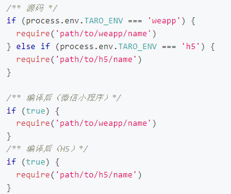

官方介绍页面：[https://taro-docs.jd.com/docs/envs](https://taro-docs.jd.com/docs/envs "https://taro-docs.jd.com/docs/envs")

***

### 多端支持

Uniapp：基本支持世面上主流的小程序平台，同时官方都有提供自己的各端案例，还多支持360小程序。

官方的第三方案例展示：[https://uniapp.dcloud.net.cn/case.html](https://uniapp.dcloud.net.cn/case.html "https://uniapp.dcloud.net.cn/case.html")

Taro：从官方文挡上看基本上支持市面上主流的小程序平台，但是并没有发现官方提供自己的案例演示，有点不太理解，官方是怎么验证可以跨这么多端的，从备注的其它案例来看基本是清一色的小程序项目，当然Taro支持鸿蒙应用开发

官方的第三方案例展示：[https://taro-docs.jd.com/showcase](https://taro-docs.jd.com/showcase "https://taro-docs.jd.com/showcase")

***

### 文挡

学习一门框架，第一入手资料就是官方文挡，双方文挡都算不错，跟着文挡都能开始入门开发项目，但是Uniapp的文挡更全、目录划分的更好，Taro文挡组件篇竟然没有附带一个demo或者示范图片，你完全看不出它长啥样，虽不是什么大问题，但是总感觉有点点小失落......

Uniapp官方文挡：

[uni-app官网 (dcloud.net.cn)](https://uniapp.dcloud.net.cn/ "uni-app官网 (dcloud.net.cn)")

Taro官方文挡：

[Taro 介绍 | Taro 文档 (jd.com)](https://taro-docs.jd.com/docs "Taro 介绍 | Taro 文档 (jd.com)")

***

### 生态

Uniapp：插件市场（[https://ext.dcloud.net.cn/](https://ext.dcloud.net.cn/ "https://ext.dcloud.net.cn/")）

基于Vue，Vue 全家桶

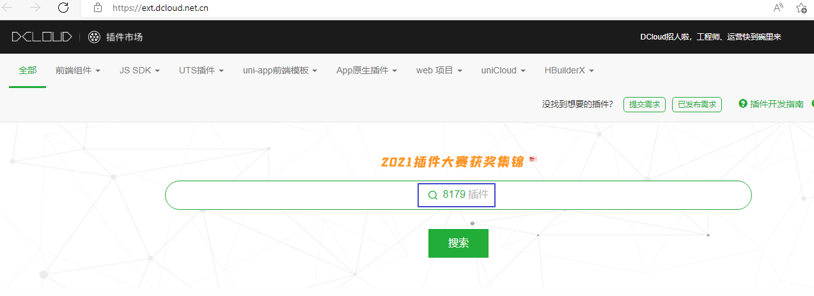

Taro：物料市场（[https://taro-ext.jd.com/](https://taro-ext.jd.com/ "https://taro-ext.jd.com/")）

支持React/Vue/Nerv，在前端框架支持上Taro完胜，但是案例在哪了？多少有点怀疑。

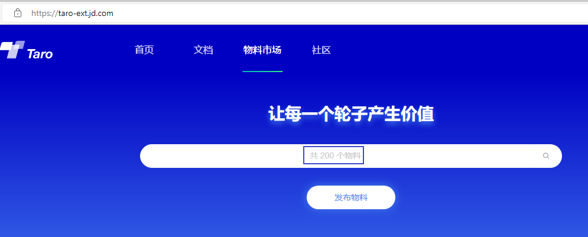

从个数看uniapp完胜，但uniapp有部分是收费的，收费插件都是可以免费试用的，合适再考虑是否正式购买，如果你实力不错，你也可以写写插件或者模板赚点毛爷爷，在插件引入方面，Uniapp因为Hbuilder X加持，插件支持一键导入，Taro则是通过命令行引入，Uniapp插件能看到评分，一般从评分就能区分插件是否有引入的必要了，Taro好像没有评分项，只能通过自己去尝试踩坑了。

***

### 社区

二跨平台框架都有自己的社区

Uniapp：QQ群+ 官方论坛

我还记得我当时用uniapp的时候，连续几天在群里AT官方人员帮忙解决问题，虽然也不是十分积极，但是还是能找到人的，而且uniapp的论坛十分活跃，我提的几个贴都有收到官方人员和其它开发的回复，助我爬出了不少坑。

Uniapp入群：[https://uniapp.dcloud.net.cn/](https://uniapp.dcloud.net.cn/ "https://uniapp.dcloud.net.cn/") 左手边导航滚动到底扫码入群

uniapp社区链接：

[DCloud问答](https://ask.dcloud.net.cn/explore/ "DCloud问答")

Taro：微信群 + github

在Taro的微信群里，你并不能发现官方的开发人员，可能有，但我提了好几个问题，也有很多开发者发问题在群里，基本都是石沉大海，应该是没有吧，只是组织一个讨论的群，有一个机器人倒是一直在发送欢迎语，但搞笑的是带的卡片链接还是404的，有问题那就去github提issue吧。

Taro还有二个让人迷惑的地方，有二个地方的社区入口都是跳转到京东商城，文挡的跳转也是404

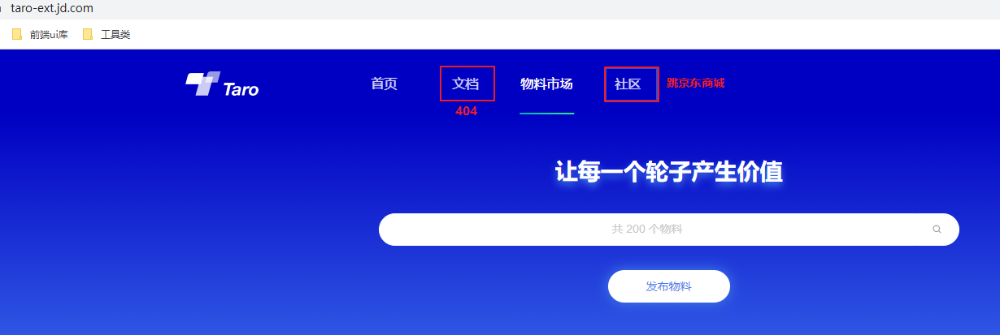

Taro入群方式：[https://taro-docs.jd.com/docs/communicate](https://taro-docs.jd.com/docs/communicate "https://taro-docs.jd.com/docs/communicate") 扫码入群

Taro官方论坛：

[Discussions · NervJS/taro · GitHub](https://github.com/NervJS/taro/discussions "Discussions · NervJS/taro · GitHub")

### 总结

上面对比了这么多，Taro处于下风，但Taro也并不是差的那么离谱，只能说离好还有点点差距，二个框架都是能用来开发项目的，所以你是会用Uniapp还是Taro了，可以在博文后面留言哦，我们一起讨论讨论吧。

如果你是react技术栈，那选Taro吧，因为你没得选！！哈哈哈......

**同时在此感谢为开源事业做贡献的大牛们，有你们的默默付出，我们才有更多的开发方式和更好的码砖体验**！
