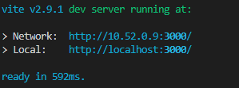

# Vite项目无法通过IP+端口的方式访问开发服务

### 前情

最近要新开一个项目，技术栈由自己安排，于是就想到使用vue3+vite来做，体验一把新技术栈

### 坑位

vite开发体验极佳，但是在项目完成的时候，想通过本地服务提前发给产品确认UI、交互等细节的时候，发现通过本机IP无法访问当前开发服务，但是localhost是可以访问的

### Why?
file:///E:/study/myblog/Element修改弹窗类组件的层级/Element修改弹窗类组件的层级.md
使用vite运行项目的时候，控制台会只出现了localhost的方式访问项目，这应该是没有将服务暴露在局域网中

### 解决方案

方式一：修改vite的server项的配置，增加host: ‘0,0,0,0’

方式二：修改package.json文件的npm scripts项，通过脚本命令传参

按以上二种方式之一修改后再启动项目，可以看到控制台已打印出本地ip访问的 址，就这样通过ip也能访问本地服务了。

