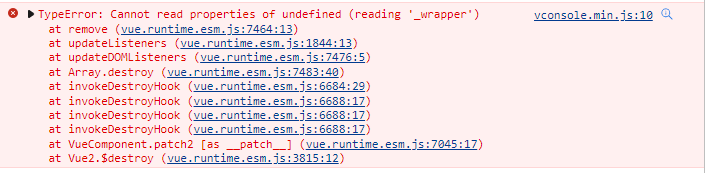

# Vue项目“TypeError: Cannot read property ‘_wrapper’ of undefined

### 前情

---

最近在开发一个H5营销活动项目，为了更高的开发效率我使用了Vue全家桶来实现。

### 坑位

---

在开发中遇到一个奇怪报错（报错截图如下），从提示看也定位不到是哪里出问题

### **Why?**

---

在报错的页面仔细看了一遍代码，发现是一个click事件绑定的函数并没有在methods里定义。

### 解决方案

---

在methods里补全缺失的方法即可