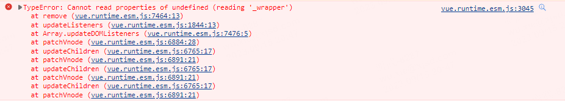
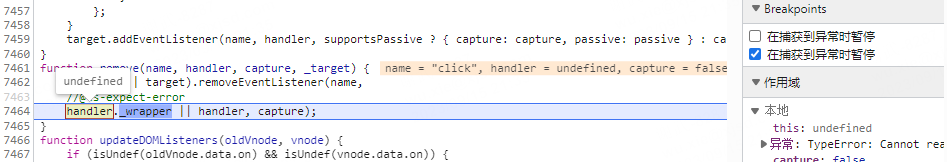

# Vue项目报TypeError: Cannot read properties of undefined (reading '_wrapper')

### 前情

最近在做一个营销活动的时候，我选择了Vue技术栈来开发。

### 坑位

项目看似一切都正常，但当我在绑定的js事件中去修改当前组件的data上的值时会报错：TypeError: Cannot read properties of undefined (reading '_wrapper')。

报错信息指向vue.runtime.esm.js，不太好定位，一度怀疑是不是vite出问题了，重启项目照样有错，我打断点也没能找到什么原因，只看到是在remove click事件的时候发现事件方法是undefined。

### **why?**

通过上面断点可以大致猜想应该是有click事件绑定的方法未定义。

其实“reading '_wrapper'”报错是提示我们项目中存在未定义的函数事件，就是我们在template模板中对元素绑定了事件，但是在vue的methods对象中没有定义该事件。所以当项目运行methods.setValues({})无法调用而报错。

### 解决方案

全局搜索@click，检查项目中是否有绑定的事件未定义，补全即可。