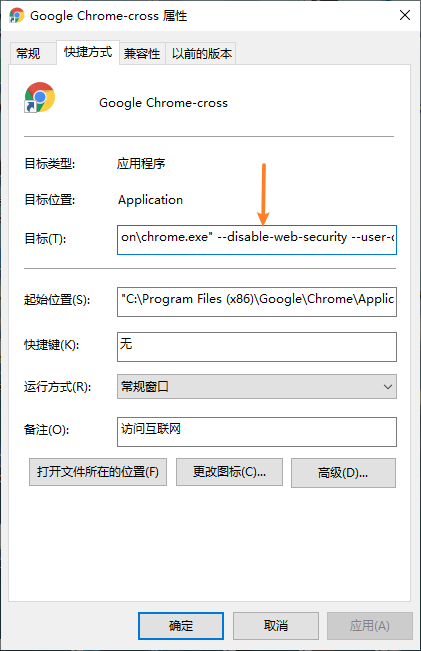
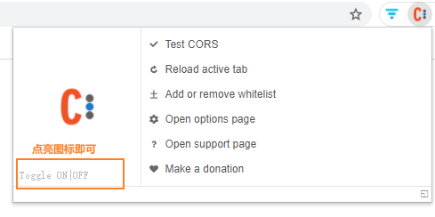

# chrome浏览器设置允许跨域

### **前情**

在访问测试搭建的测试环境的时候，发现接口因为跨域全部失败了，服务端又没有时间设置允许跨域，又急于使用，于是想到是不是可以使用跨域浏览器

### 放开chrome的跨域设置步骤

1. 复制一个chrome快捷图标，改名为Google Chrome-cross(自己取一个能够和正常快捷方式区分的即可)
2. 在复制的Chrome的快捷图标上鼠标右键 --> 属性 
3. 在目标栏后加上 --disable-web-security --user-data dir=C:\MyChromeDevUserData，C:\MyChromeDevUserData 是你本地硬盘的一个目录，最好自己新建一个，上面的目录路径换成自己新建的目录即可

    

4. 后续通过此快捷方式启动的chrome都是放开了浏览器跨域限制的

### Mac系统

MAC 上Chrome跨域设置，是直接终端敲命令设置，不过每次mac重启后，都要重新执行命令

设置步骤：

1. 新建一个目录。用于存放保存关闭安全策略后的用户信息的，名称和位置随意
2. 在终端中输入：open -n /Applications/Google\ Chrome.app/ --args --disable-web-security --user-data-dir=/Users/Vic/Documents/MyChromeDevUserData
其中，/Users/Vic/Documents/MyChromeDevUserData 对应步骤1新建目录的路径

### 插件解决跨域

下载chrome插件Access-Control-Allow-Origin，可以解决浏览器跨域问题，注意插件版本尽量选用新一点的，我一开始装了个版本较低的没有效果，后面换成版本新一点的0.1.5是可以，我用的版本插件下载地址：[https://download.csdn.net/download/u011669024/21331760?spm=1001.2014.3001.5503](https://download.csdn.net/download/u011669024/21331760?spm=1001.2014.3001.5503)

