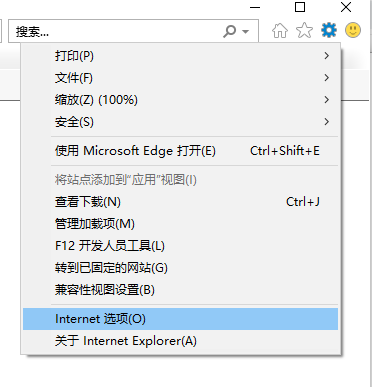

# ie浏览器设置允许跨域

### **前情**

在访问测试搭建的测试环境的时候，发现接口因为跨域全部失败了，服务端又没有时间设置允许跨域，又急于使用，于是想到是不是可以使用跨域浏览器，上一次已解决chrome允许跨域，这一次来设置IE允许跨域

### 放开IE的跨域设置步骤

1. 启动IE，点击工具→Internet选项

    

2. 选择安全→自定义级别

    

3. 启用【其它】选项下的下面二项

    

    至此IE已经可以跨域请求数据了。