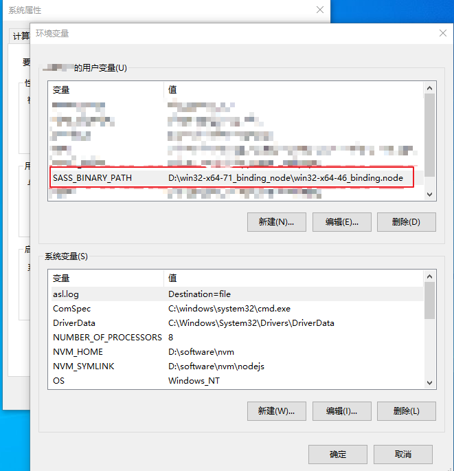

# node-sass安装问题

### 前情

---

最近在开发一个小程序项目，为了开发速度，部分页面使用原有H5，但原有H5需要对小程序做一定兼容适配，发现原有H5项目是个很古老项目。

### 坑位

---

在项目启动前，需要执行npm install安装项目依赖，但是卡在node-sass一直安装不成功

控制台报错如下：

```bash
> node-sass@3.13.1 install E:\work\code\mall-order\node_modules\gulp-sass\node_modules\node-sass
> node scripts/install.js

Downloading binary from https://github.com/sass/node-sass/releases/download/v3.13.1/win32-x64-57_binding.node
Cannot download "https://github.com/sass/node-sass/releases/download/v3.13.1/win32-x64-57_binding.node": 

HTTP error 404 Not Found

Hint: If github.com is not accessible in your location
      try setting a proxy via HTTP_PROXY, e.g.

      export HTTP_PROXY=http://example.com:1234

or configure npm proxy via

      npm config set proxy http://example.com:8080

> node-sass@4.14.1 install E:\work\code\mall-order\node_modules\node-sass
> node scripts/install.js

Cached binary found at C:\Users\xiewu1\AppData\Roaming\npm-cache\node-sass\4.14.1\win32-x64-57_binding.node

> core-js@2.6.12 postinstall E:\work\code\mall-order\node_modules\core-js
> node -e "try{require('./postinstall')}catch(e){}"

Thank you for using core-js ( https://github.com/zloirock/core-js ) for polyfilling JavaScript standard library!

The project needs your help! Please consider supporting of core-js on Open Collective or Patreon: 
> https://opencollective.com/core-js 
> https://www.patreon.com/zloirock 

Also, the author of core-js ( https://github.com/zloirock ) is looking for a good job -)

> node-sass@3.13.1 postinstall E:\work\code\mall-order\node_modules\gulp-sass\node_modules\node-sass
> node scripts/build.js

Building: D:\software\nvm\nodejs\node.exe E:\work\code\mall-order\node_modules\node-gyp\bin\node-gyp.js rebuild --verbose --libsass_ext= --libsass_cflags= --libsass_ldflags= --libsass_library=
gyp info it worked if it ends with ok
gyp verb cli [ 'D:\\software\\nvm\\nodejs\\node.exe',
gyp verb cli   'E:\\work\\code\\mall-order\\node_modules\\node-gyp\\bin\\node-gyp.js',
gyp verb cli   'rebuild',
gyp verb cli   '--verbose',
gyp verb cli   '--libsass_ext=',
gyp verb cli   '--libsass_cflags=',
gyp verb cli   '--libsass_ldflags=',
gyp verb cli   '--libsass_library=' ]
gyp info using node-gyp@3.8.0
gyp info using node@8.11.4 | win32 | x64
gyp verb command rebuild []
gyp verb command clean []
gyp verb clean removing "build" directory
gyp verb command configure []
gyp verb check python checking for Python executable "python2" in the PATH
gyp verb `which` succeeded python2 C:\Python27\python2.EXE
gyp verb check python version `C:\Python27\python2.EXE -c "import sys; print "2.7.11
gyp verb check python version .%s.%s" % sys.version_info[:3];"` returned: %j
gyp verb get node dir no --target version specified, falling back to host node version: 8.11.4
gyp verb command install [ '8.11.4' ]
gyp verb install input version string "8.11.4"
gyp verb install installing version: 8.11.4
gyp verb install --ensure was passed, so won't reinstall if already installed
gyp verb install version is already installed, need to check "installVersion"
gyp verb got "installVersion" 9
gyp verb needs "installVersion" 9
gyp verb install version is good
gyp verb get node dir target node version installed: 8.11.4
gyp verb build dir attempting to create "build" dir: E:\work\code\mall-order\node_modules\gulp-sass\node_modules\node-sass\build
gyp verb build dir "build" dir needed to be created? E:\work\code\mall-order\node_modules\gulp-sass\node_modules\node-sass\build
gyp verb find vs2017 Found installation at: C:\Program Files (x86)\Microsoft Visual Studio\2017\BuildTools
gyp verb find vs2017   - Found Microsoft.VisualStudio.Component.VC.Tools.x86.x64
gyp verb find vs2017   - Found Microsoft.VisualStudio.VC.MSBuild.Base
gyp verb find vs2017   - Missing a Windows SDK (Microsoft.VisualStudio.Component.Windows10SDK.* or Microsoft.VisualStudio.Component.Windows81SDK)
gyp verb find vs2017   - Some required components are missing, not using this installation
gyp verb Not using VS2017: No usable installation of VS2017 found
gyp verb build/config.gypi creating config file
gyp verb build/config.gypi writing out config file: E:\work\code\mall-order\node_modules\gulp-sass\node_modules\node-sass\build\config.gypi
gyp verb config.gypi checking for gypi file: E:\work\code\mall-order\node_modules\gulp-sass\node_modules\node-sass\config.gypi
gyp verb common.gypi checking for gypi file: E:\work\code\mall-order\node_modules\gulp-sass\node_modules\node-sass\common.gypi
gyp verb gyp gyp format was not specified; forcing "msvs"
gyp info spawn C:\Python27\python2.EXE
gyp info spawn args [ 'E:\\work\\code\\mall-order\\node_modules\\node-gyp\\gyp\\gyp_main.py',
gyp info spawn args   'binding.gyp',
gyp info spawn args   '-f',
gyp info spawn args   'msvs',
gyp info spawn args   '-G',
gyp info spawn args   'msvs_version=auto',
gyp info spawn args   '-I',
gyp info spawn args   'E:\\work\\code\\mall-order\\node_modules\\gulp-sass\\node_modules\\node-sass\\build\\config.gypi',
gyp info spawn args   '-I',
gyp info spawn args   'E:\\work\\code\\mall-order\\node_modules\\node-gyp\\addon.gypi',
gyp info spawn args   '-I',
gyp info spawn args   'C:\\Users\\xiewu1\\.node-gyp\\8.11.4\\include\\node\\common.gypi',
gyp info spawn args   '-Dlibrary=shared_library',
gyp info spawn args   '-Dvisibility=default',
gyp info spawn args   '-Dnode_root_dir=C:\\Users\\xiewu1\\.node-gyp\\8.11.4',
gyp info spawn args   '-Dnode_gyp_dir=E:\\work\\code\\mall-order\\node_modules\\node-gyp',
gyp info spawn args   '-Dnode_lib_file=C:\\Users\\xiewu1\\.node-gyp\\8.11.4\\<(target_arch)\\node.lib',
gyp info spawn args   '-Dmodule_root_dir=E:\\work\\code\\mall-order\\node_modules\\gulp-sass\\node_modules\\node-sass',
gyp info spawn args   '-Dnode_engine=v8',
gyp info spawn args   '--depth=.',
gyp info spawn args   '--no-parallel',
gyp info spawn args   '--generator-output',
gyp info spawn args   'E:\\work\\code\\mall-order\\node_modules\\gulp-sass\\node_modules\\node-sass\\build',
gyp info spawn args   '-Goutput_dir=.' ]
gyp verb command build []
gyp verb build type Release
gyp verb architecture x64
gyp verb node dev dir C:\Users\xiewu1\.node-gyp\8.11.4
gyp verb found first Solution file build/binding.sln
gyp verb could not find "msbuild.exe" in PATH - finding location in registry 
gyp info spawn C:\Windows\Microsoft.NET\Framework\v4.0.30319\msbuild.exe
gyp info spawn args [ 'build/binding.sln',
gyp info spawn args   '/nologo',
gyp info spawn args   '/p:Configuration=Release;Platform=x64' ]
在此解决方案中一次生成一个项目。若要启用并行生成，请添加“/m”开关。
生成启动时间为 2023/1/17 18:06:29。
节点 1 上的项目“E:\work\code\mall-order\node_modules\gulp-sass\node_modules\node-sass\build\binding.sln”(默认目标)。
ValidateSolutionConfiguration:
  正在生成解决方案配置“Release|x64”。
MSBUILD : error MSB3428: 未能加载 Visual C++ 组件“VCBuild.exe”。要解决此问题，1) 安装 .NET Framework 2.0 SDK；2) 安装 Microsoft Visual Studio 2005；或 3) 如果将该组件安装到了其他位置，请将其
位置添加到系统路径中。 [E:\work\code\mall-order\no
de_modules\gulp-sass\node_modules\node-sass\build\binding.sln]
已完成生成项目“E:\work\code\mall-order\node_modules\gulp-sass\node_modules\node-sass\build\binding.sln”(默认目标)的操作 - 失败。

生成失败。

“E:\work\code\mall-order\node_modules\gulp-sass\node_modules\node-sass\build\binding.sln”(默认目标) (1) ->
(_src_\libsass 目标) ->
  MSBUILD : error MSB3428: 未能加载 Visual C++ 组件“VCBuild.exe”。要解决此问题，1) 安装 .NET Framework 2.0 SDK；2) 安装 Microsoft Visual Studio 2005；或 3) 如果将该组件安装到了其他位置，请将 
其位置添加到系统路径中。 [E:\work\code\mall-order\
node_modules\gulp-sass\node_modules\node-sass\build\binding.sln]

    0 个警告
    1 个错误

已用时间 00:00:00.84
gyp ERR! build error 
gyp ERR! stack Error: `C:\Windows\Microsoft.NET\Framework\v4.0.30319\msbuild.exe` failed with exit code: 1
gyp ERR! stack     at ChildProcess.onExit (E:\work\code\mall-order\node_modules\node-gyp\lib\build.js:262:23)
gyp ERR! stack     at emitTwo (events.js:126:13)
gyp ERR! stack     at ChildProcess.emit (events.js:214:7)
gyp ERR! stack     at Process.ChildProcess._handle.onexit (internal/child_process.js:198:12)
gyp ERR! System Windows_NT 10.0.19044
gyp ERR! command "D:\\software\\nvm\\nodejs\\node.exe" "E:\\work\\code\\mall-order\\node_modules\\node-gyp\\bin\\node-gyp.js" "rebuild" "--verbose" "--libsass_ext=" "--libsass_cflags=" "--libsass_ldflags=" "--libsass_library="
gyp ERR! cwd E:\work\code\mall-order\node_modules\gulp-sass\node_modules\node-sass
gyp ERR! node -v v8.11.4
gyp ERR! node-gyp -v v3.8.0
gyp ERR! not ok
npm WARN optional SKIPPING OPTIONAL DEPENDENCY: fsevents@~2.3.2 (node_modules\chokidar\node_modules\fsevents):
npm WARN notsup SKIPPING OPTIONAL DEPENDENCY: Unsupported platform for fsevents@2.3.2: wanted {"os":"darwin","arch":"any"} (current: {"os":"win32","arch":"x64"})
npm WARN optional SKIPPING OPTIONAL DEPENDENCY: fsevents@^1.0.0 (node_modules\watchpack\node_modules\chokidar\node_modules\fsevents):
npm WARN notsup SKIPPING OPTIONAL DEPENDENCY: Unsupported platform for fsevents@1.2.13: wanted {"os":"darwin","arch":"any"} (current: {"os":"win32","arch":"x64"})
npm WARN sass-loader@6.0.7 requires a peer of webpack@^2.0.0 || ^3.0.0 || ^4.0.0 but none is installed. You must install peer dependencies yourself.
npm WARN ws@8.2.3 requires a peer of bufferutil@^4.0.1 but none is installed. You must install peer dependencies yourself.
npm WARN ws@8.2.3 requires a peer of utf-8-validate@^5.0.2 but none is installed. You must install peer dependencies yourself.
npm WARN order@1.1.0 No repository field.
npm WARN order@1.1.0 No license field.

npm ERR! code ELIFECYCLE
npm ERR! errno 1
npm ERR! node-sass@3.13.1 postinstall: `node scripts/build.js`
npm ERR! Exit status 1
npm ERR!
npm ERR! Failed at the node-sass@3.13.1 postinstall script.
npm ERR! This is probably not a problem with npm. There is likely additional logging output above.

npm ERR! A complete log of this run can be found in:
npm ERR!     C:\Users\xiewu1\AppData\Roaming\npm-cache\_logs\2023-01-17T10_06_51_657Z-debug.log
PS E:\work\code\mall-order> npm i
npm WARN deprecated request@2.88.2: request has been deprecated, see https://github.com/request/request/issues/3142
npm WARN deprecated uuid@3.4.0: Please upgrade  to version 7 or higher.  Older versions may use Math.random() in certain circumstances, which is known to be problematic.  See https://v8.dev/blog/math-random for details.
npm WARN deprecated fsevents@1.2.13: fsevents 1 will break on node v14+ and could be using insecure binaries. Upgrade to fsevents 2.

> node-sass@3.13.1 install E:\work\code\mall-order\node_modules\gulp-sass\node_modules\node-sass
> node scripts/install.js

Downloading binary from https://npm.taobao.org/mirrors/node-sass//v3.13.1/win32-x64-57_binding.node
Cannot download "https://npm.taobao.org/mirrors/node-sass//v3.13.1/win32-x64-57_binding.node": 

HTTP error 404 Not Found

Hint: If github.com is not accessible in your location
      try setting a proxy via HTTP_PROXY, e.g.

      export HTTP_PROXY=http://example.com:1234

or configure npm proxy via

      npm config set proxy http://example.com:8080

> node-sass@3.13.1 postinstall E:\work\code\mall-order\node_modules\gulp-sass\node_modules\node-sass
> node scripts/build.js

Building: D:\software\nvm\nodejs\node.exe E:\work\code\mall-order\node_modules\node-gyp\bin\node-gyp.js rebuild --verbose --libsass_ext= --libsass_cflags= --libsass_ldflags= --libsass_library=
gyp info it worked if it ends with ok
gyp verb cli [ 'D:\\software\\nvm\\nodejs\\node.exe',
gyp verb cli   'E:\\work\\code\\mall-order\\node_modules\\node-gyp\\bin\\node-gyp.js',
gyp verb cli   'rebuild',
gyp verb cli   '--verbose',
gyp verb cli   '--libsass_ext=',
gyp verb cli   '--libsass_cflags=',
gyp verb cli   '--libsass_ldflags=',
gyp verb cli   '--libsass_library=' ]
gyp info using node-gyp@3.8.0
gyp info using node@8.11.4 | win32 | x64
gyp verb command rebuild []
gyp verb command clean []
gyp verb clean removing "build" directory
gyp verb command configure []
gyp verb check python checking for Python executable "python2" in the PATH
gyp verb `which` succeeded python2 C:\Python27\python2.EXE
gyp verb check python version `C:\Python27\python2.EXE -c "import sys; print "2.7.11
gyp verb check python version .%s.%s" % sys.version_info[:3];"` returned: %j
gyp verb get node dir no --target version specified, falling back to host node version: 8.11.4
gyp verb command install [ '8.11.4' ]
gyp verb install input version string "8.11.4"
gyp verb install installing version: 8.11.4
gyp verb install --ensure was passed, so won't reinstall if already installed
gyp verb install version is already installed, need to check "installVersion"
gyp verb got "installVersion" 9
gyp verb needs "installVersion" 9
gyp verb install version is good
gyp verb get node dir target node version installed: 8.11.4
gyp verb build dir attempting to create "build" dir: E:\work\code\mall-order\node_modules\gulp-sass\node_modules\node-sass\build
gyp verb build dir "build" dir needed to be created? E:\work\code\mall-order\node_modules\gulp-sass\node_modules\node-sass\build
gyp verb find vs2017 Found installation at: C:\Program Files (x86)\Microsoft Visual Studio\2017\BuildTools
gyp verb find vs2017   - Found Microsoft.VisualStudio.Component.VC.Tools.x86.x64
gyp verb find vs2017   - Found Microsoft.VisualStudio.VC.MSBuild.Base
gyp verb find vs2017   - Missing a Windows SDK (Microsoft.VisualStudio.Component.Windows10SDK.* or Microsoft.VisualStudio.Component.Windows81SDK)
gyp verb find vs2017   - Some required components are missing, not using this installation
gyp verb Not using VS2017: No usable installation of VS2017 found
gyp verb build/config.gypi creating config file
gyp verb build/config.gypi writing out config file: E:\work\code\mall-order\node_modules\gulp-sass\node_modules\node-sass\build\config.gypi
gyp verb config.gypi checking for gypi file: E:\work\code\mall-order\node_modules\gulp-sass\node_modules\node-sass\config.gypi
gyp verb common.gypi checking for gypi file: E:\work\code\mall-order\node_modules\gulp-sass\node_modules\node-sass\common.gypi
gyp verb gyp gyp format was not specified; forcing "msvs"
gyp info spawn C:\Python27\python2.EXE
gyp info spawn args [ 'E:\\work\\code\\mall-order\\node_modules\\node-gyp\\gyp\\gyp_main.py',
gyp info spawn args   'binding.gyp',
gyp info spawn args   '-f',
gyp info spawn args   'msvs',
gyp info spawn args   '-G',
gyp info spawn args   'msvs_version=auto',
gyp info spawn args   '-I',
gyp info spawn args   'E:\\work\\code\\mall-order\\node_modules\\gulp-sass\\node_modules\\node-sass\\build\\config.gypi',
gyp info spawn args   '-I',
gyp info spawn args   'E:\\work\\code\\mall-order\\node_modules\\node-gyp\\addon.gypi',
gyp info spawn args   '-I',
gyp info spawn args   'C:\\Users\\xiewu1\\.node-gyp\\8.11.4\\include\\node\\common.gypi',
gyp info spawn args   '-Dlibrary=shared_library',
gyp info spawn args   '-Dvisibility=default',
gyp info spawn args   '-Dnode_root_dir=C:\\Users\\xiewu1\\.node-gyp\\8.11.4',
gyp info spawn args   '-Dnode_gyp_dir=E:\\work\\code\\mall-order\\node_modules\\node-gyp',
gyp info spawn args   '-Dnode_lib_file=C:\\Users\\xiewu1\\.node-gyp\\8.11.4\\<(target_arch)\\node.lib',
gyp info spawn args   '-Dmodule_root_dir=E:\\work\\code\\mall-order\\node_modules\\gulp-sass\\node_modules\\node-sass',
gyp info spawn args   '-Dnode_engine=v8',
gyp info spawn args   '--depth=.',
gyp info spawn args   '--no-parallel',
gyp info spawn args   '--generator-output',
gyp info spawn args   'E:\\work\\code\\mall-order\\node_modules\\gulp-sass\\node_modules\\node-sass\\build',
gyp info spawn args   '-Goutput_dir=.' ]
gyp verb command build []
gyp verb build type Release
gyp verb architecture x64
gyp verb node dev dir C:\Users\xiewu1\.node-gyp\8.11.4
gyp verb found first Solution file build/binding.sln
gyp verb could not find "msbuild.exe" in PATH - finding location in registry 
gyp info spawn C:\Windows\Microsoft.NET\Framework\v4.0.30319\msbuild.exe
gyp info spawn args [ 'build/binding.sln',
gyp info spawn args   '/nologo',
gyp info spawn args   '/p:Configuration=Release;Platform=x64' ]
在此解决方案中一次生成一个项目。若要启用并行生成，请添加“/m”开关。
生成启动时间为 2023/1/17 18:14:17。
节点 1 上的项目“E:\work\code\mall-order\node_modules\gulp-sass\node_modules\node-sass\build\binding.sln”(默认目标)。
ValidateSolutionConfiguration:
  正在生成解决方案配置“Release|x64”。
MSBUILD : error MSB3428: 未能加载 Visual C++ 组件“VCBuild.exe”。要解决此问题，1) 安装 .NET Framework 2.0 SDK；2) 安装 Microsoft Visual Studio 2005；或 3) 如果将该组件安装到了其他位置，请将其
位置添加到系统路径中。 [E:\work\code\mall-order\no
de_modules\gulp-sass\node_modules\node-sass\build\binding.sln]
已完成生成项目“E:\work\code\mall-order\node_modules\gulp-sass\node_modules\node-sass\build\binding.sln”(默认目标)的操作 - 失败。

生成失败。

“E:\work\code\mall-order\node_modules\gulp-sass\node_modules\node-sass\build\binding.sln”(默认目标) (1) ->
(_src_\libsass 目标) ->
  MSBUILD : error MSB3428: 未能加载 Visual C++ 组件“VCBuild.exe”。要解决此问题，1) 安装 .NET Framework 2.0 SDK；2) 安装 Microsoft Visual Studio 2005；或 3) 如果将该组件安装到了其他位置，请将 
其位置添加到系统路径中。 [E:\work\code\mall-order\
node_modules\gulp-sass\node_modules\node-sass\build\binding.sln]

    0 个警告
    1 个错误

已用时间 00:00:00.91
gyp ERR! build error 
gyp ERR! stack Error: `C:\Windows\Microsoft.NET\Framework\v4.0.30319\msbuild.exe` failed with exit code: 1
gyp ERR! stack     at ChildProcess.onExit (E:\work\code\mall-order\node_modules\node-gyp\lib\build.js:262:23)
gyp ERR! stack     at emitTwo (events.js:126:13)
gyp ERR! stack     at ChildProcess.emit (events.js:214:7)
gyp ERR! stack     at Process.ChildProcess._handle.onexit (internal/child_process.js:198:12)
gyp ERR! System Windows_NT 10.0.19044
gyp ERR! command "D:\\software\\nvm\\nodejs\\node.exe" "E:\\work\\code\\mall-order\\node_modules\\node-gyp\\bin\\node-gyp.js" "rebuild" "--verbose" "--libsass_ext=" "--libsass_cflags=" "--libsass_ldflags=" "--libsass_library="
gyp ERR! cwd E:\work\code\mall-order\node_modules\gulp-sass\node_modules\node-sass
gyp ERR! node -v v8.11.4
gyp ERR! node-gyp -v v3.8.0
gyp ERR! not ok
```

### **Why?**

---

从错误提示看，需要你去安装.NET Framework 2.0 SDK，我也去做了，但是没一点鸟用，但是我们注意日志的最前面有一句话：

Cannot download "[https://npm.taobao.org/mirrors/node-sass//v3.13.1/win32-x64-57_binding.node](https://npm.taobao.org/mirrors/node-sass//v3.13.1/win32-x64-57_binding.node)"，可以推断node-sass安装失败的原因是网络限制导致无法下载.node文件

### 解决方案

---

### 方案1：

- STEP 1：手动下载此文件，再到此网页下[Releases · sass/node-sass (github.com)](https://github.com/sass/node-sass/releases)下载指定版本的win32-x64-57_binding.node文件到本地
- STEP 2：设置环境变量：SASS_BINARY_PATH，值为你存放下载文件的路径



- STEP 3：再执行npm install，安装node-sass的时候就会直接使用本地的win32-x64-57_binding.node，不会去远程拉取了。

### 方案2：

如果项目有修改的可能，可以把node-sass换成dart-sass