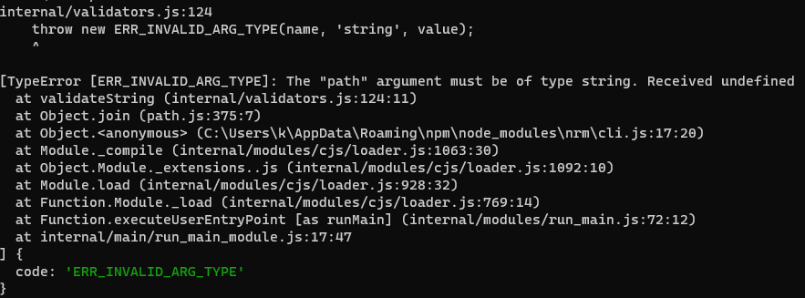

# nrm安装后无法使用

### 前情

---

在使用node.js的过程中，经常会时不是遇到有些包下载安装慢或者失败，有时可以尝试切换源来解决这类问题

### 坑

---

通过npm install nrm -g安装完nrm后运行nrm一直报错



### Why?

---

在64位操作系统中运行node时，process.platform会返回“win32”，这实际上应该是node的BUG，但nrm应该没有对这种问题做兼容处理

### 解决方案1

---

通过错误提示找到nrm下的cli.js文件，把第17行改成如下：

```jsx
const NRMRC = path.join(process.env[process.platform == 'win32' ? 'USERPROFILE' : 'HOME'], '.nrmrc');
```

### 解决方案2

---

此问题在nrm的1.2.2版本中已修复，但是npm没有同步更新，暂时可以通过gihub的方式安装

```bash
npm install -g Pana/nrm
```

参考链接：[https://github.com/Pana/nrm/issues/93](https://github.com/Pana/nrm/issues/93)