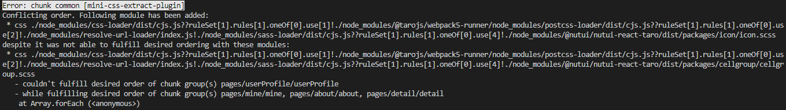

# taro 编译错误Error: chunk common [mini-css-extract-plugin]

### 前情

---

最近在开发一个小程序项目，基于公司的技术栈是React，于是使用Taro来开发小程序。

### 坑位

---

在开发中经常性的报类似如下的错误，大致意思是说你引入模块的顺序在不同模块中不一致



### **Why?**

---

主要是mini-css-extract-plugin插件为了避免样式冲突，对你模块引入的css顺序有要求

### 解决方案

---

**方案1（推荐）：**

根据提示的文件，对比这几个文件模块引入的顺序修正顺序即可

**方案2：**

如果实在冲突比较多或者很难找到哪里出错，就像我这种情况，对比了顺序真的是一样的，就是报错，可以在config/index.js文件下mini配置忽略css引入顺序，这样整个项目再也不会报类似的警告

```jsx
mini: {
	...
	miniCssExtractPluginOption: {
   ignoreOrder: true   // 解决css引入顺序不一导致冲突的警告问题
 }
}
```