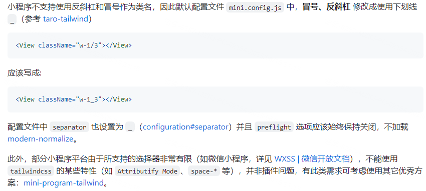
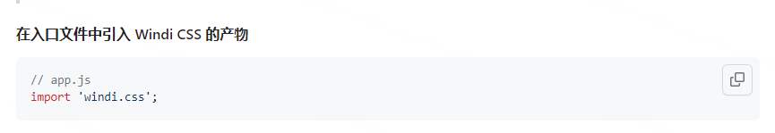
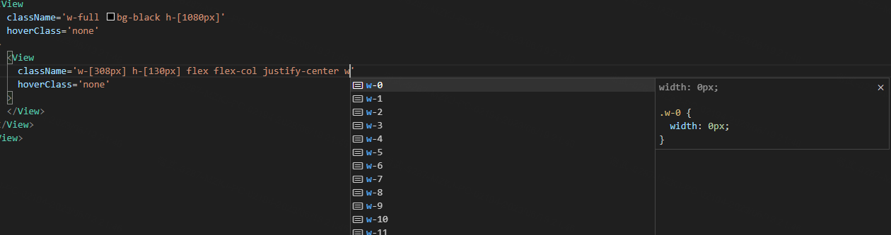
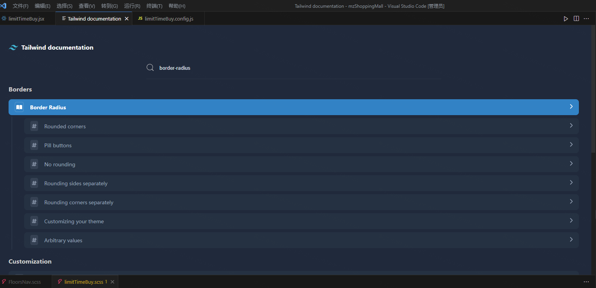

# taro项目引入Tailwindcss

## **前情**

Tailwind CSS 是一个原子类 CSS 框架，它将基础的 CSS 全部拆分为原子级别，同时还补全各种浏览器模式前缀，兼容性也不错。它的工作原理是扫描所有 HTML 文件、JavaScript 组件以及任何模板中的 CSS 类名，然后生成相应的样式代码并写入到一个静态 CSS 文件中。Tailwind CSS 快速、灵活、可靠，没有运行时负担。自动接触了Tailwindcss后，目前已经是我项目的标配了。正好手上有一个Taro的小程序项目，我也想让它引入Tailwindcss。

## 世面上流行的几种接入方式

### 方式1：通过https://github.com/pcdotfan/taro-plugin-tailwind插件引入

缺点：需要特殊处理冒号和反斜杠，同时对于tailwindcss的一些高级特性不支持，开发体验大打折扣



### 方式2：通过https://github.com/dcasia/mini-program-tailwind插件引入

缺点：它实际上使用的是windi.css，目前windi.css已经处于不维护状态，官方已不推荐使用



### 方式3：通过使用https://github.com/sonofmagic/weapp-tailwindcss插件引入

基本与普通web项目使用差异不是特别大，目前我的taro项目就是使用此方式引入的。

## 通过https://github.com/sonofmagic/weapp-tailwindcss插件引入步骤

### STEP 1：安装相关依赖

```bash
npm install -D tailwindcss postcss autoprefixer weapp-tailwindcss
```

### STEP 2：补充配置

```bash
# 初始化 tailwind.config.js 文件
npx tailwindcss init
```

执行上面命令生成tailwind.config.js，并增加如下配置

```jsx
/** @type {import('tailwindcss').Config} */
module.exports = {
  // 不在 content 包括的文件内编写的 class，不会生成对应的工具类
  content: ['./public/index.html', './src/**/*.{html,js,ts,jsx,tsx,vue}'],
  // 其他配置项
  // ...
  corePlugins: {
    // 不需要 preflight，因为这主要是给 h5 的，如果你要同时开发小程序和 h5 端，你应该使用环境变量来控制它
    preflight: false
  }
}
```

手动创建postcss.config.js，并注册Tailwindcss

```jsx
// postcss.config.js
// 假如你使用的框架/工具不支持 postcss.config.js，则可以使用内联的写法
// 其中 `autoprefixer` 有可能已经内置了，假如框架内置了可以去除
module.exports = {
  plugins: {
    tailwindcss: {},
    autoprefixer: {},
  }
}
```

在项目的配置文件 config/index中注册weapp-tailwindcss:

```jsx
// config/index.js
const { UnifiedWebpackPluginV5 } = require('weapp-tailwindcss/webpack')

{
  mini: {
    webpackChain(chain, webpack) {
      chain.merge({
        plugin: {
          install: {
            plugin: UnifiedWebpackPluginV5,
            args: [{
              appType: 'taro'
            }]
          }
        }
      })
    }
  }
}
```

另外在和 @tarojs/plugin-html 一起使用时，需要配置下 postcss-html-transform 这个插件，不然默认配置下它会移除整个 Tailwindcss 注入的  css var 区域块，这会造成所有 tw-* 相关变量找不到，导致样式大量挂掉的问题。

```jsx
// config/index.js
config = {
  // ...
  mini: {
    // ...
    postcss: {
      htmltransform: {
        enable: true,
        // 设置成 false 表示 不去除 * 相关的选择器区块
        // 假如开启这个配置，它会把 tailwindcss 整个 css var 的区域块直接去除掉
        // 需要用 config 套一层，官方文档上是错的
        config: {
          removeCursorStyle: false,
        }
      },
    },
  },
}
```

### STEP 3：在项目入口引入Tailwindcss

```css
// 在Taro项目下的app.scss中增加如下css代码
@import 'tailwindcss/base';
@import 'tailwindcss/utilities';
@import 'tailwindcss/components'
```

这样就可以愉快的在 taro项目中使用Tailwindcss开发需求了。

## 友情提示

在vs code下为了更好的用户开发体验，可以安装 Tailwindcss相关的插件

****Tailwind CSS IntelliSense：此插件提示书写提示,极大的提高开发体验****



****Tailwind Documentation：文挡查询，在vscode中快速查询，直接搜索对应样式名就能查到使用方式，这个可有可无，直接查官方文挡也是一样的****

