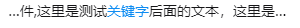

# 文本超出省略号之前后省略号实现

标签：css js

---

## 前情
最近在做聊天记录需求时，对于查到的消息体需要高亮显示，前后内容超出需要显示省略号，效果如下图：



对于后省略号是可以通过的一串css来实现的，主要是css的代码段如下：

``` css
/*css省略号代码段*/
overflow: hidden;
text-overflow: ellipsis;
position: relative;
white-space: nowrap;
```


## 解决方案1

### Javascript实现

**实现原理**

这是我一强悍同事提出的解决方法，通过的canvas去测试文本的长度，再用长度和当前容器比较，如果大于当前容器，则前省略号+手动截取前5个字+关键字+后面内容，再用css省略号代码段去自动实现后面内容省略号。

**关健代码**

```html
<div id="container" style="width: 200px"></div>
```

``` css
#container {
    background-color: aquamarine;
    display: flex;
    flex-direction: column;
  }

  #container div {
    overflow: hidden;
    text-overflow: ellipsis;
    position: relative;
    white-space: nowrap;
  }
```

``` js
let keywords = "测试";
let container = document.querySelector('#container');
let containerWidth = container.offsetWidth;
wordList.forEach((word) => {
    let width = ctx.measureText(word).width;
    if (containerWidth > width) {
        container.appendChild(createSpan(word));
    } else {
        let ygIndex = word.indexOf(keywords);
        if (ygIndex > 5) {
            word = ' ...' + word.slice(ygIndex - 5);
        }
        container.appendChild(createSpan(word));
    }
})

function createSpan(word) {
    let span = document.createElement('div');
    span.innerText = word;
    return span;
}
```
[完整测试地址](https://codepen.io/xiewu/pen/bGwwWmw)

## Css实现

**实现原理**

同事提供的方式是可行的，只是我考虑到通过canvas去绘会有一定成本，于是一直在思考是否可以通过纯css来解决，突然一下想到文本是不是可以控制方向，于是通过把内容分成三段：前面文本+关键字+后面文本，改变第一段文字的文本渲染方向，再用css省略号代码段去自动实现前后省略号

**关键代码**

``` html
<div class="text_test">
  <span>这里是前面的内容哦，67890123456</span>
  <span>关键字</span>
  <span>这里是后面后文本哦，啦啦啦啦</span>
</div>
```

``` css
.text_test{
  display:flex;
  width:400px;
}
.text_test span{
  flex:0 1 auto;
  overflow:hidden;
  text-overflow:ellipsis;
  white-space:nowrap;
}
.text_test span:nth-of-type(1) {
  max-width: 180px;
  direction:rtl;
}
.text_test span:nth-of-type(2) {
  flex:none;
}
```

[完整测试地址](https://codepen.io/xiewu/pen/jOMMbOa)