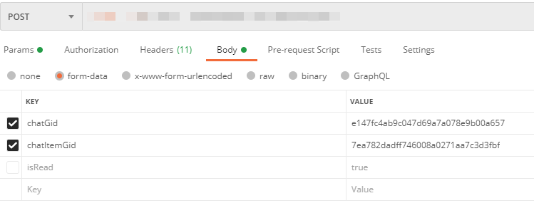

# 前后端数据传递之form-data

### 前情

---

最近在项目开发中，跟服务端连调发现接口一直报错，服务端一直提示是数据没有传，而通过浏览器控制台发现数据是有传的。

### 坑

---

服务通过postman自测是OK的。经过和服务端一起定位发现服务端只接收以form-data格式传递的数据，而我传递的是JSON对象。



### Why?

---

平时前后端接口数据连调很少有走form-data形式的，form-data一般用来做文件上传才会用到，如果要以form-data传递数据，则需要通过借助FormData对象

### 解决方案

---

1. 跟服务端协商，服务端是否可修改成支持直接传递JSON对象（推荐）
2. 也可前端直接传递form-data数据给服务端即可，关键代码如下：

```js
let param = new FormData();
param.append('chatGid', '******');
param.append('chatItemGid', '******');
// 注意事项
// 对于传递文件对象，是需要三个参数的,第一个为字段，第二个是二进制文件本体，第三个是文件名
param.append('file', 文件二进对象, 文件名);
```

### 问题关联

---

前后端数据连调有几种常见的数据传递格式，对于不同格式，需要设置不能的Content-Type

1. text/plain ：纯文本格式
2. application/json： JSON数据格式
3. application/x-www-form-urlencoded ：默认的encType，form表单数据被编码为key/value格式发送到服务器（表单默认的提交数据的格式）
4. multipart/form-data ： 需要在表单中进行文件上传时使用