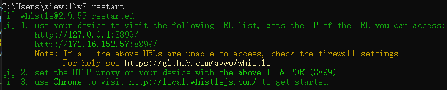
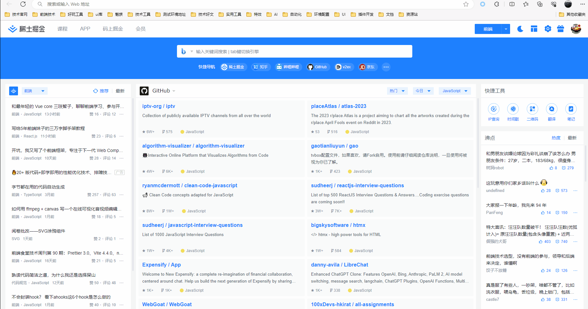
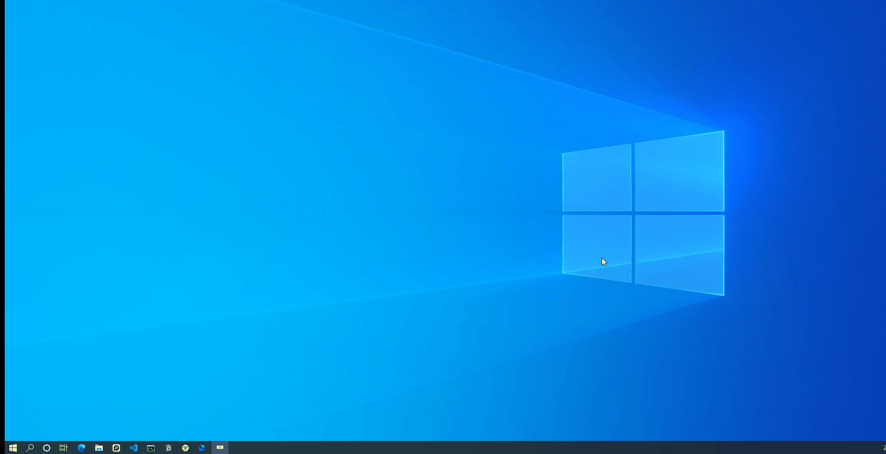
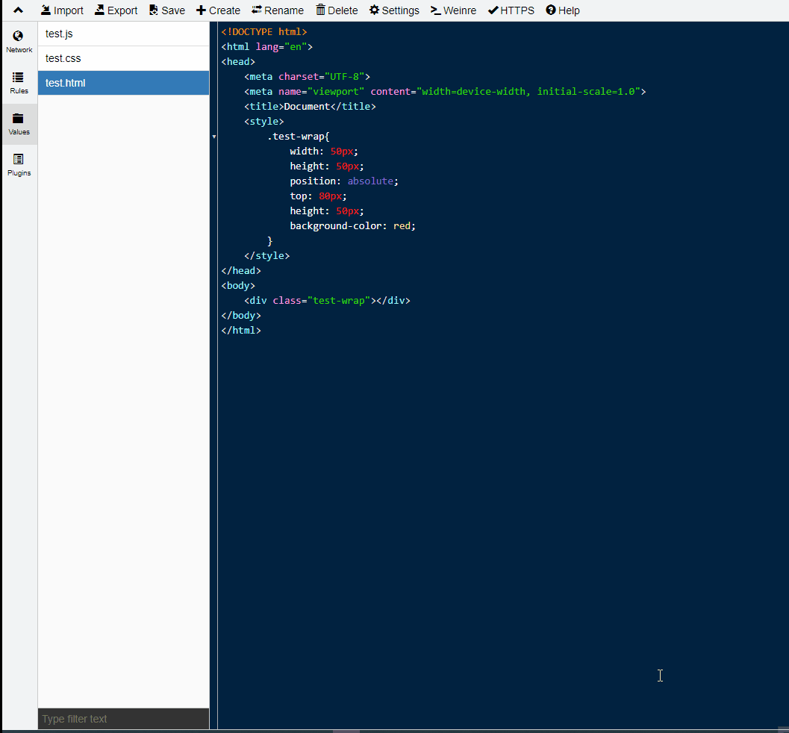

# 前端调试代理神器Whistle

### 概述

抓包一直是平时开发中经常要做的，有一款好用的抓包工具可以让开发体验更棒，以前一直用fiddler，fiddler虽然强悍，但是入手有一定难度，而且较笨重，今天介绍另一款抓包工具：Whistle。

Whistle是一款前端调试神器，通过拦截、修改和模拟网络请求，帮助开发人员调试接口、排查网络问题。它提供实时查看、修改请求响应数据的功能，支持重定向、缓存策略等自定义配置。

官网：[wproxy.org/whistle/](https://link.juejin.cn/?target=https%3A%2F%2Fwproxy.org%2Fwhistle%2F)

### 安装

Whistle依赖node环境，安装前先安装好node。

```bash
npm install -g whistle
```

### 常用命令

```bash
// 查看版本
whistle -V

// 查看whistle命令帮助
whistle help

// 启动whistle,可以指定端口
w2 start
w2 start -p 8899 

// 重启whistle(也支持指定端口)
w2 restart

// 停止whistke
w2 stop
```

看到如下界面表示whistle运行成功了



### 前提配置

Whistle要成功抓包，需要配置代理，代理可以在浏览器端，也可以全局配置，如果你是在PC上调试推荐使用浏览器插件代理，如果你是想在手机上调试，请使用全局代理，再配置手机的代理

### **浏览器代理**

浏览器代理的话要使用浏览器的代理插件[SwitchOmega](https://link.juejin.cn/?target=https%3A%2F%2Fchrome.google.com%2Fwebstore%2Fdetail%2Fproxy-switchyomega%2Fpadekgcemlokbadohgkifijomclgjgif)，我平时习惯使用Edge，此处以Edge浏览器为示例说明

让插件常驻工具栏


配置浏览器代理



用浏览器代理的好处是可以随时切换关闭


### 全局代理

因为我是window电脑，此处以window电脑为示例说明



### 手机代理

移动端要配置代理的话，需要保证手机 WIFI 和 PC 是同一网络，再按如下步骤配置（安卓手机


### Https支持

上面代理配置好后，虽然能拆包了，但是只能抓到http的包，想开启https的话安装证书即可


window下证书安装的时候一直下一步即可，其中有一步做一下如下图选择即可，安装好证书后记得重启下whiste，不然不会生效，我就踩过这个坑，导致证书装了很多次，最后发现重启OK了。


如果要抓包手机端的https请求，手机扫码上面https证书二维码，下载证书安装即可。

至此就完成whiste的抓包配置，可以愉快玩耍了

### Whiste食用轻指南

**认识Whiste控制台**


- NetWork: 查看请求响应的详细信息及请求列表的Timeline
- Rules: 匹配规则，whistle核心，想用好whiste，主要就是修改此处的配置
- Values: 配置key-value的数据，在Rules里面配置可以通过{key}获取
- Plugins: 显示所有已安装的插件列表，开启关闭插件功能

**NetWork认识**


**Values添加**

Values配置后记得按下ctrl+s保存一下



**Rules配置一览（非常重要）**


```bash
# 地址代理 输入百度网址浏览的是魅族官网
# www.baidu.com www.meizu.com

# 线上js代理到本地
# https://pss.bdstatic.com/r/www/cache/static/protocol/https/bundles/es6-polyfill_388d059.js file://C:\Users\xiewu1\Desktop\test\test.js # 使用本地文件
# https://pss.bdstatic.com/r/www/cache/static/protocol/https/bundles/es6-polyfill_388d059.js js://{test.js} # 使用values里文件

# 线上js插入js代码
# https://pss.bdstatic.com/r/www/cache/static/protocol/https/bundles/es6-polyfill_388d059.js jsAppend://C:\Users\xiewu1\Desktop\test\test.js # 使用本地文件
# https://pss.bdstatic.com/r/www/cache/static/protocol/https/bundles/es6-polyfill_388d059.js jsAppend://{test.js} # 使用values里文件

# 指定内容替换为本地文件 
# https://pss.bdstatic.com/r/www/cache/static/protocol/https/bundles/es6-polyfill_388d059.js resBody://C:\Users\xiewu1\Desktop\test\test.js
 
# 指定内容替换为 values 操作值 
# https://pss.bdstatic.com/r/www/cache/static/protocol/https/bundles/es6-polyfill_388d059.js resBody://{test.js} 

# 注入html
# www.baidu.com html://C:\Users\xiewu1\Desktop\test\test.html # 使用本地文件
# www.baidu.com htmlPrepend://{test.html} # 使用values里文件
# www.baidu.com html://{test.html} # 使用values里文件

# 注入js
# www.baidu.com js://C:/Users/xiewu1/Desktop/test/test.js # 使用本地js文件
# www.baidu.com js://{test.js} # 使用values里文件
# www.baidu.com jsPrepend://{test.js} # 使用values里文件，文件内容插入到页面head最前面
# www.baidu.com jsAppend://{test.js} # 使用values里文件，文件内容插入到页面底部

# 注入存储在电脑本地的css
# www.baidu.com css://C:\Users\xiewu1\Desktop\test\test.css
# www.baidu.com cssAppend://C:\Users\xiewu1\Desktop\test\test.css
# 注入存储在Values里的css
# www.baidu.com cssPrepend://{test.css}

# 接口数据mock数据
# http://api/users/getUsers file://C:\Users\xiewu1\Desktop\test\test.json

# 模拟接口 5s 后返回 
# http://api/users/getUsers resDelay://5000 

# 使用whistle提供的插件
# www.baidu.com whistle.inspect://vConsole # 会在页面上插入一个类似于vconsole.js的控制台，主要用于移动端调试，支持vConsole,eruda,mdebug

# 解决跨域问题
# `*` 表示设置 access-control-allow-origin: * 
# www.example.com resCors://* 
 
# `enable` 表示设置 access-control-allow-origin: http://originHost 
# 及 access-control-allow-credentials: true 
# www.example.com resCors://enable
```

> 注：文件代理这一块如果想统一写法，可以直接用resbody://，不一定要js:// css:// file://这样
> 

**Plugins安装**

目前我只用到过这个插件，如果你要调试手机项目装这个的插件真的非常棒

```bash
// 安装inspect插件，在网页中注入vConsole,eruda,mdebug等控制台，方便调试手机上的H5页面，
// 再也不用担心手机上调试啥都看不到的情况了
npm install whistle.inspect
```

**Whistle抓包过滤（好用）**


