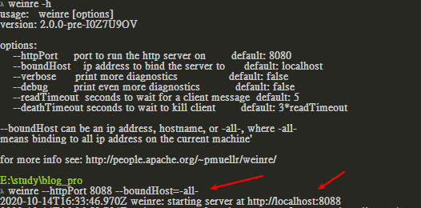
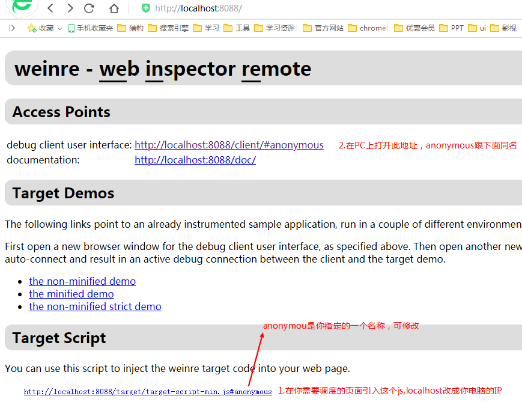
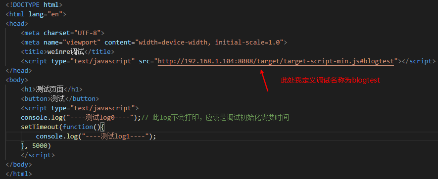
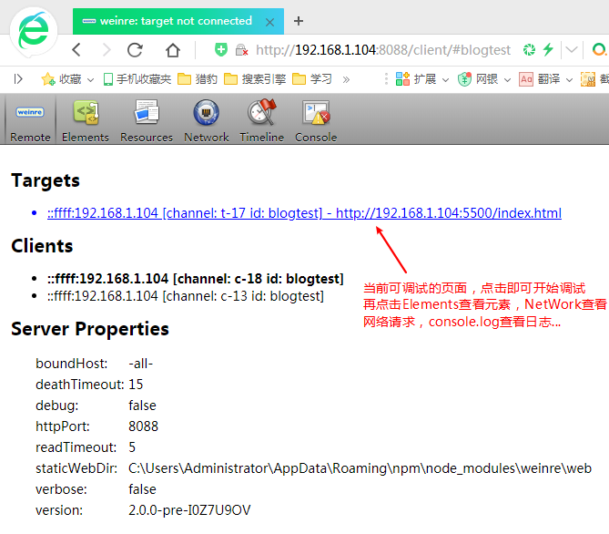

---
## 前情
前端开发有分移动和PC，PC端调试有浏览器自带的开发者工具，移动端虽然也可以在PC浏览器端模拟调试，但是最终开发完还是需要去真机上调试的。

## 移动端调试

### 调试方式1：vConsole调试面板
腾讯出品的 Web 调试面板，vConsole 会在你网页中加一个悬浮的小按钮，可以点击它来打开关闭调试面板，并查看 DOM、Console、Network和本地存储 等信息。基本可以满足普通前端开发的需求。

**使用方式**

* 可以通过npm安装模块来使用，关键代码如下：
``` js
var VConsole = require('path/to/vconsole.min.js');
var vConsole = new VConsole();
```
* 通过script标签引入js文件使用，关键代码如下：
``` js
<script src="path/to/vconsole.min.js"></script>
<script>
var vConsole = new VConsole();
</script>
```
详细使用教程见 [vConsole使用教程](https://github.com/Tencent/vConsole/blob/dev/doc/tutorial_CN.md)
### 调试方式2：weinre
weinre是一款网页检查工具，可以通过在本地启动一个weinre服务，并在想要调试的手机网页中嵌入一段js脚本来实现和电脑的通信，已达到类似浏览器开发工具那样的的调试效果，它的操作界面和 vConsole 差不多，主要包括查看 DOM、Console、Network 等，只不过这一切是在电脑上操作，而不是在手机上。微信web开发者工具的移动调试也是借助于此。

**使用方式**
1. 通过npm全局安装weinre模块并启动服务器，端口号为8088
``` cmd
npm install weinre -g
weinre --httpPort 8088 --boundHost=-all-
```

2. 浏览器访问http://localhost:8088


3. 打开http://你电脑的ip:8088/client/#你上面定义的名称，默认为anonymous



